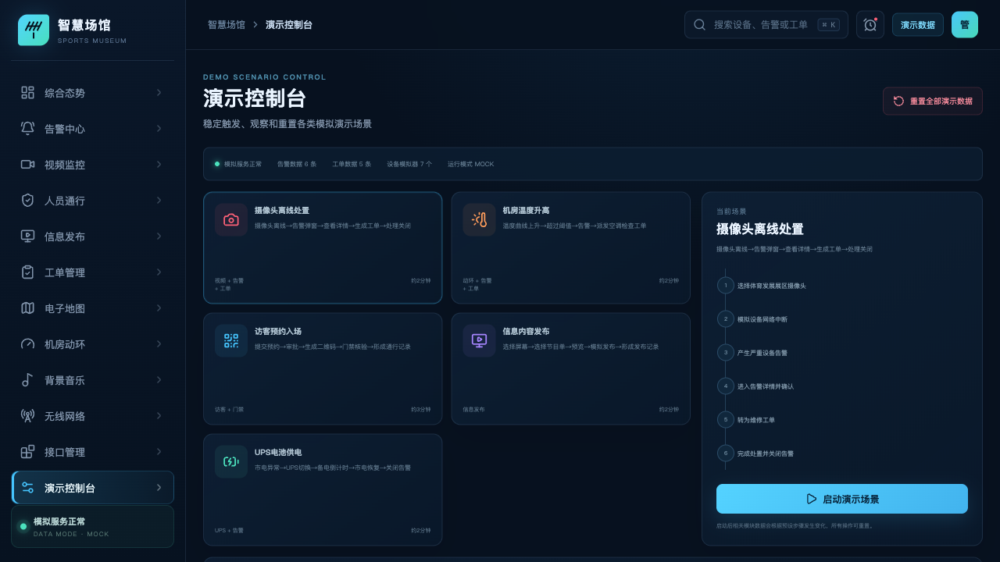

# 体育博物馆智慧化综合管理平台 Demo

第一阶段为配置驱动的本地 Demo，全部使用模拟数据，不连接真实摄像头、门禁、信息发布屏、动环、UPS、背景音乐或无线网络设备。



## 当前状态

- 12 个业务页面均已提供完整模拟数据和操作逻辑。
- 支持告警转工单、访客审批与二维码、模拟发布、地图联动及固定演示场景。
- 客户资料到达后，优先替换配置、点位和素材，不改动已确认的页面框架。
- 新同事请先阅读 [HANDOFF.md](HANDOFF.md)。

## 本地运行

```bash
npm install
npm run dev -- --port 5196
```

默认开发地址：`http://127.0.0.1:5196`

## 构建检查

```bash
npm run check
```

## 配置替换

- 项目名称和主题：`config/project.json`
- 除视频外的主要模拟数据：`config/platform.json`
- 摄像头、楼层和录像片段：`public/config/cameras.json`

修改配置后重新启动开发服务；若浏览器保留了之前的操作状态，在“演示控制台”执行一次重置。

## 交付文档

- 完整范围与验收标准：`WORK_PLAN.md`
- 配置字段与替换方法：`config/README.md`
- 客户资料简要清单：`CUSTOMER_MATERIALS_CHECKLIST.md`
- 完整演示流程：`DEMO_SCRIPT.md`
- 第二阶段接口边界：`INTERFACE_BOUNDARIES.md`

注意：第一阶段全部为模拟适配器，未完成任何真实 SDK、GB/T 28181、公众号、人脸、门禁、信息发布、动环或 UPS 联调。
