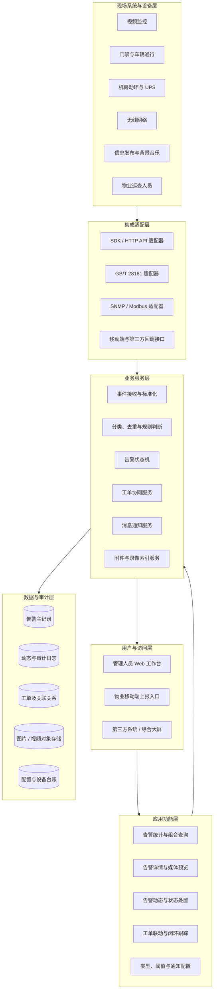
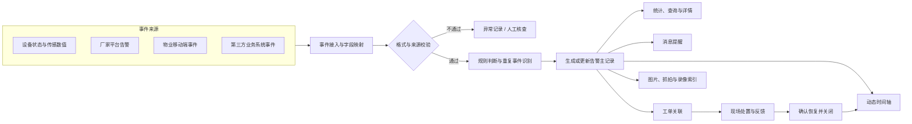
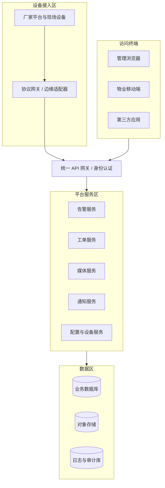
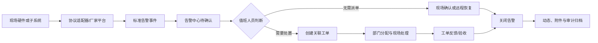
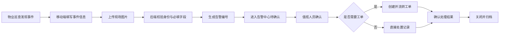
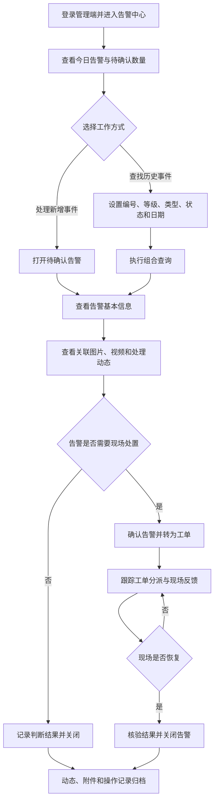
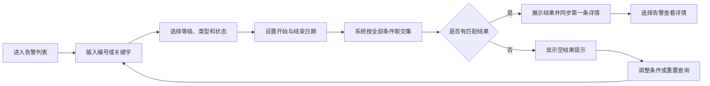
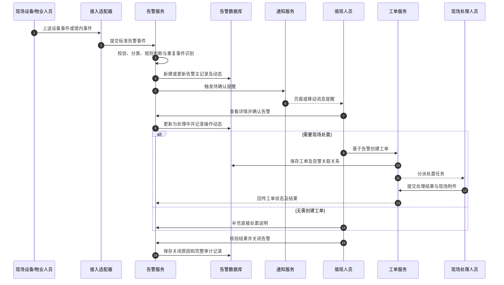

# 体育博物馆智慧化综合管理平台

## 告警中心管理功能说明

| 文档属性 | 内容 |
| --- | --- |
| 文档版本 | V1.2 |
| 编制日期 | 2026-08-31 |
| 对应模块 | 告警中心管理 |
| 页面路由 | `/alarms` |
| 适用对象 | 场馆管理人员、安保值班人员、设施运维人员、物业巡查人员、系统实施人员 |
| 系统状态 | 验收版本；平台功能、配置中心与接口适配能力均纳入统一管理 |

---

## 1. 建设目标

告警中心用于统一接收、展示和处置体育博物馆内的硬件设备告警与馆内事件告警。系统将来自视频监控、机房动环、人员通行、UPS、无线网络、信息发布等子系统的事件，与物业巡查人员主动上报的馆内事件汇聚到同一工作台，形成“发现—提醒—确认—派单—处置—关闭—留痕”的管理闭环。

本模块重点解决以下问题：

1. 不同子系统告警分散，值班人员无法统一查看。
2. 馆内设施、安全和服务事件缺少统一上报入口。
3. 告警确认、工单派发和处理结果之间缺少关联。
4. 图片、视频、处理动态等事件证据无法集中归档。
5. 历史追溯时缺少按编号、等级、类型、状态和时间组合查询的能力。

## 2. 需求符合性检查

| 序号 | 需求项 | 当前实现 | 结论 |
| ---: | --- | --- | --- |
| 1 | 硬件设备告警提醒 | 支持视频、动环、通行、UPS、无线网络、信息发布等来源的告警记录与状态统计 | 已具备 |
| 2 | 馆内事件告警提醒 | 支持“馆内事件、安全隐患、服务事件、环境异常”等事件类型 | 已具备 |
| 3 | 园区物业移动端上报 | 提供“物业事件上报”入口，可录入人员、电话、位置、描述和现场附件；支持统一接口接收移动端事件 | 符合 |
| 4 | 显示告警基本信息 | 显示编号、标题、等级、类型、来源、设备、位置、时间和状态 | 已具备 |
| 5 | 按告警编号查询 | 关键字输入框支持告警编号精确或模糊查询 | 已具备 |
| 6 | 按告警等级查询 | 支持一般、提示，展示范围限定为日常运维告警 | 已具备 |
| 7 | 按告警类型查询 | 支持按当前数据中的告警类型独立筛选 | 已具备 |
| 8 | 按告警状态查询 | 支持待确认、处理中、已关闭 | 已具备 |
| 9 | 按发生时间查询 | 支持开始日期、结束日期组合查询 | 已具备 |
| 10 | 展示告警详情 | 右侧详情区展示说明、来源、设备、位置、时间及上报信息 | 已具备 |
| 11 | 展示告警动态 | 按时间顺序记录产生、通知、确认、转工单和关闭等动作 | 已具备 |
| 12 | 展示工单列表 | 展示与当前告警关联的工单编号、标题、部门、处理人和状态 | 已具备 |
| 13 | 关联图片和视频 | 以附件卡片展示图片、视频及资源状态，支持点击预览；资源通道由后台统一配置 | 符合 |

## 3. 系统架构设计

### 3.1 分层逻辑架构

告警中心采用“统一事件模型 + 分层服务 + 可插拔适配器”的设计。上层页面只使用平台标准告警对象，不直接依赖摄像机、门禁、动环或 UPS 厂家的私有字段；更换设备或获得现场资料后，主要调整设备配置、协议适配器和映射规则。

*图 1　告警中心分层逻辑架构*

### 3.2 告警事件处理架构

所有自动告警与人工上报事件先转换为统一模型，再执行分类、重复事件识别、状态流转和业务联动。这样可以保证查询、详情、通知与工单使用同一份告警主记录，避免各子系统分别维护造成信息不一致。

*图 2　告警事件接收、处置与归档关系*

### 3.3 部署与接口边界

*图 3　平台部署及接口边界*

| 架构范围 | 平台实现 | 后台配置方式 |
| --- | --- | --- |
| 页面与交互 | 提供告警查询、详情、动态、附件预览和工单联动 | 通过应用配置控制功能入口、显示字段和操作权限 |
| 数据来源 | 采用统一告警模型接收设备事件、人工上报及第三方系统事件 | 通过数据源、事件映射、消息通道和启停状态进行管理 |
| 设备接入 | 提供可插拔协议适配框架，兼容 SDK、GB/T 28181、SNMP、Modbus 和 HTTP | 按设备厂家能力配置协议类型、连接参数、设备编码和事件映射 |
| 附件与录像 | 提供图片归档、录像索引、资源检索和受控访问能力 | 配置对象存储、录像平台、保留期限和访问权限 |
| 安全与权限 | 提供统一认证、接口鉴权、角色权限、数据权限和审计记录 | 按组织、角色、终端、接口应用和数据范围配置 |

> 平台通过“适配器模板 + 接入实例 + 参数配置 + 通道开关”管理现场差异。具体启用范围取决于设备支持能力、厂家授权信息和后台接入配置；通道启停不改变平台已具备的管理、配置和扩展能力。

## 4. 页面总体说明

告警中心由四部分组成：

1. **快捷操作区**：查看待确认告警、发起物业事件上报。
2. **告警统计区**：展示今日告警、待确认、处理中、已关闭和平均响应时间。
3. **告警查询与列表区**：提供组合查询条件及告警结果列表。
4. **告警详情与处置区**：展示详情、附件、动态、工单，并提供确认、转工单、关闭操作。

*图 4　告警中心总体界面*

## 5. 告警统计

页面顶部统计卡片用于帮助值班人员快速识别当前工作量和风险状态。

| 指标 | 说明 |
| --- | --- |
| 今日告警 | 当前数据集中当日产生的告警总数 |
| 待确认 | 尚未由值班人员确认的告警数量 |
| 处理中 | 已确认、已派单或正在现场处置的告警数量 |
| 已关闭 | 已完成处置并由管理人员关闭的告警数量 |
| 平均响应 | 从告警产生到首次确认的平均时间，由告警服务根据事件时间实时计算 |

当前展示以日常运维类、低风险事件为主：一般告警采用橙色提醒，提示类告警采用蓝色提醒。告警颜色只用于辅助识别，最终处置规则应由等级、类型和场馆运行制度共同决定。

## 6. 告警查询

### 6.1 查询条件

| 查询条件 | 使用方式 |
| --- | --- |
| 告警编号/关键字 | 可输入告警编号、标题、位置、设备编号或来源系统 |
| 告警等级 | 全部、一般、提示 |
| 告警类型 | 根据当前告警数据动态生成，如设备离线、环境异常、异常通行、供电异常等 |
| 告警状态 | 全部、待确认、处理中、已关闭 |
| 开始日期 | 只显示发生日期大于或等于该日期的告警 |
| 结束日期 | 只显示发生日期小于或等于该日期的告警 |

多个条件之间采用“同时满足”的组合查询逻辑。例如，选择“环境异常”，并将开始、结束日期均设为 2026-08-24，系统只显示该日期内的环境异常告警。

*图 5　按告警类型与发生时间组合查询*

### 6.2 列表字段

告警列表展示以下字段：

- 告警等级；
- 告警标题；
- 告警编号；
- 发生位置；
- 告警类型；
- 来源系统；
- 发生日期及时间；
- 当前处理状态。

点击列表中的任意告警，右侧详情区同步切换到该告警。筛选条件变化后，详情区自动展示当前结果集中的第一条告警，避免列表与详情内容不一致。

## 7. 物业移动端事件上报

### 7.1 适用场景

物业巡查人员发现下列事件时，可通过移动端上报：

- 展陈设施松动、破损或运行异常；
- 消防通道占用、积水、异味等安全隐患；
- 观众服务、秩序维护类事件；
- 温湿度、照明、噪声等环境异常；
- 暂时无法由硬件系统自动发现的其他馆内事件。

### 7.2 上报字段

| 字段 | 必填 | 说明 |
| --- | :---: | --- |
| 事件标题 | 是 | 简要描述事件，如“展厅设施异常” |
| 告警等级 | 是 | 一般、提示 |
| 事件类型 | 是 | 馆内事件、设备故障、安全隐患、服务事件、环境异常 |
| 发生位置 | 是 | 具体楼层、展区或功能空间 |
| 上报人员 | 是 | 物业巡查人员姓名或工号 |
| 联系电话 | 是 | 便于值班中心联系核实 |
| 事件描述 | 是 | 现场情况、已采取措施及风险说明 |
| 现场附件 | 否 | 支持选择 0–3 张现场照片并上传至告警附件库 |

*图 6　物业移动端事件告警上报表单*

### 7.3 提交结果

提交成功后，系统执行以下动作：

1. 自动生成格式为 `ALYYYYMMDDNNNN` 的告警编号。
2. 告警来源记录为“物业移动端”，上报渠道记录为“园区物业移动端”。
3. 新告警进入“待确认”状态，并置于列表顶部。
4. 现场照片登记为告警附件。
5. 处理动态新增“物业事件上报”记录。
6. 顶部待确认数量与今日告警数量同步更新。

*图 7　物业事件上报后自动进入待确认队列*

> 平台提供统一事件上报接口，物业移动端、企业微信或公众号均可按后台应用配置接入。接口统一完成身份认证、字段校验、附件上传、编号生成和消息通知，确保不同上报入口进入同一告警闭环。

## 8. 告警详情

### 8.1 基本信息

详情区展示：告警编号、描述、等级、类型、来源系统、关联设备、发生位置和发生时间。对于物业上报事件，还展示上报人员与上报渠道。

### 8.2 关联图片和视频

附件区按卡片展示图片和视频，内容包括文件名称、附件类型与资源状态。点击卡片可打开附件预览。

资源状态说明：

| 状态 | 说明 |
| --- | --- |
| 已上传 | 物业人员已提交现场照片 |
| 已归档 | 告警产生时的抓拍已归档到事件记录 |
| 可回看 | 已具备对应录像资源索引 |
| 通道未启用 | 后台尚未启用对应视频或录像通道；启用并配置授权参数后即可按权限访问 |

*图 8　告警关联视频资源预览*

平台在附件记录中统一保存平台编码、设备编码、通道号、录像开始时间、录像结束时间和资源索引。播放地址由媒体服务按用户权限动态签发，厂家原始鉴权信息不会直接暴露给浏览器。

## 9. 告警动态

告警动态以时间轴记录事件全生命周期，典型节点包括：

1. 系统产生告警或物业提交事件；
2. 消息通知值班人员；
3. 值班人员确认告警；
4. 告警转为工单；
5. 工单分配及现场处理；
6. 管理人员确认恢复并关闭告警。

每条动态至少包含动作时间、动作名称和操作说明。生产系统还应记录操作人账号、所属部门、终端来源和操作前后状态，满足审计与责任追溯要求。

## 10. 告警与工单联动

### 10.1 转工单规则

值班人员点击“转为工单”后，系统基于当前告警创建处置工单，并自动带入：

- 告警标题和编号；
- 告警等级对应的工单优先级；
- 发生位置；
- 来源系统；
- 建议处理部门；
- 告警与工单关联关系。

若当前告警已有关联工单，系统不重复创建，并提示已有工单编号。

### 10.2 工单列表

详情区显示当前告警关联的全部工单，包括工单编号、标题、负责部门、处理人和状态。点击工单可进入工单管理模块查看完整流程。

*图 9　告警确认后转工单并形成动态留痕*

## 11. 业务流程

### 11.1 硬件设备告警流程

### 11.2 物业移动端上报流程

### 11.3 管理人员日常使用流程

*图 10　管理人员日常查询与处置流程*

### 11.4 组合查询使用流程

*图 11　告警组合查询操作流程*

### 11.5 告警处置时序

*图 12　告警接收、确认、派单与关闭时序*

## 12. 状态流转

| 当前状态 | 可执行操作 | 下一状态 | 说明 |
| --- | --- | --- | --- |
| 待确认 | 确认告警 | 处理中 | 值班人员已知悉并开始处理 |
| 待确认 | 转为工单 | 处理中 | 创建工单并记录关联关系 |
| 处理中 | 转为工单 | 处理中 | 无工单时创建；已有工单时不重复创建 |
| 待确认/处理中 | 关闭告警 | 已关闭 | 应确认现场已恢复或风险已解除 |
| 已关闭 | 查看详情 | 已关闭 | 只读追溯，不再重复关闭 |

关闭告警时系统要求记录关闭原因；对需要重点关注的告警，可通过后台处置规则要求上传处理结果并由指定角色复核。

## 13. 核心数据结构

### 13.1 告警主记录

| 字段 | 示例 | 说明 |
| --- | --- | --- |
| `id` | `AL202608310038` | 告警唯一编号 |
| `title` | 展厅设施异常 | 告警标题 |
| `level` | 一般 | 告警等级 |
| `type` | 馆内事件 | 告警类型 |
| `source` | 物业移动端 | 来源系统 |
| `location` | 一层互动体验区 | 发生位置 |
| `device` | 馆内事件 | 关联设备或事件对象 |
| `time` | `2026-08-31 18:34` | 发生时间 |
| `status` | 待确认 | 当前状态 |
| `description` | 巡查发现…… | 事件描述 |
| `reporter` | 物业巡查员 | 上报人员 |
| `reportChannel` | 园区物业移动端 | 上报渠道 |
| `relatedWorkOrder` | `WO202608240024` | 关联工单编号 |

### 13.2 附件记录

附件记录包含附件编号、类型、名称、采集时间和资源状态。生产系统还应增加对象存储地址、文件摘要、文件大小、上传人、访问权限和保留期限。

### 13.3 动态记录

动态记录包含动作时间、动作标题、详细说明、操作人 ID、操作来源、前后状态和审计流水号，用于全过程审计与责任追溯。

## 14. 接口与系统边界

平台通过接口管理、适配器管理和应用管理，对以下能力进行统一配置：

1. **设备协议适配**：支持创建 SDK、GB/T 28181、SNMP、Modbus、HTTP 等接入实例，并配置连接参数、设备编码与事件映射。
2. **移动端接入**：支持配置物业移动端、企业微信或公众号应用的身份认证、事件上报、附件上传和消息回调。
3. **媒体资源管理**：支持配置对象存储、视频平台、录像检索、资源保留期限和带权限的临时访问地址。
4. **告警数据服务**：统一完成编号生成、数据持久化、并发控制、重复事件识别和状态流转。
5. **身份与审计**：支持用户、角色、数据权限、接口应用权限、操作审计和复核规则配置。
6. **消息渠道**：支持按需启用短信、企业微信、公众号、App Push 等通知通道，并配置接收范围与提醒规则。
7. **处置策略**：支持配置告警升级、超时催办、值班表和应急预案联动规则。

所有来源数据均由适配器转换为平台标准告警模型，前端页面只使用统一数据结构，不直接解析厂家私有字段。设备或通道未启用时，平台保留其配置实例和能力状态，管理员可在取得授权参数后直接启用。

## 15. 权限配置

| 角色 | 权限范围 |
| --- | --- |
| 物业巡查人员 | 新建馆内事件、上传附件、查看本人上报记录 |
| 场馆值班人员 | 查看告警、确认告警、补充动态、转工单 |
| 部门负责人 | 分派工单、调整等级、查看部门范围告警 |
| 系统管理员 | 配置类型、阈值、通知规则、接口与权限 |
| 审计人员 | 只读查看告警、动态、工单和操作日志 |

## 16. 验收条目

| 验收编号 | 验收场景 | 预期结果 |
| --- | --- | --- |
| ALM-01 | 按完整告警编号查询 | 只显示对应告警，详情同步一致 |
| ALM-02 | 组合选择等级、类型、状态和日期 | 结果同时满足全部条件 |
| ALM-03 | 提交物业馆内事件并附两张照片 | 自动生成编号，状态为待确认，照片进入附件区 |
| ALM-04 | 确认待确认告警 | 状态变为处理中，动态新增确认记录 |
| ALM-05 | 将告警转为工单 | 工单创建成功，告警动态和工单列表同步更新 |
| ALM-06 | 对同一告警重复转工单 | 不重复创建，提示已有工单 |
| ALM-07 | 点击图片与视频附件 | 打开对应预览并显示资源状态 |
| ALM-08 | 关闭处理中告警 | 状态变为已关闭，动态记录关闭操作 |
| ALM-09 | 在 1280×720 分辨率下操作 | 页面无横向溢出，查询和处置按钮可用 |
| ALM-10 | 检查浏览器控制台 | 无运行错误和警告 |

## 17. 当前验证结果

- 配置校验：通过；
- 7 项自动化配置契约测试：通过；
- TypeScript 编译与生产构建：通过；
- 告警类型与时间组合查询：通过；
- 物业事件上报与编号生成：通过；
- 告警确认、转工单、动态及工单列表联动：通过；
- 图片/视频附件预览：通过；
- 浏览器控制台：0 错误、0 警告。

---

**文档说明：** 本文档用于告警中心模块的功能验收、操作核对和系统交付说明。现场设备、接口应用和通知通道的启用状态，以后台配置中心中的设备能力、授权参数、通道开关和权限策略为准。
