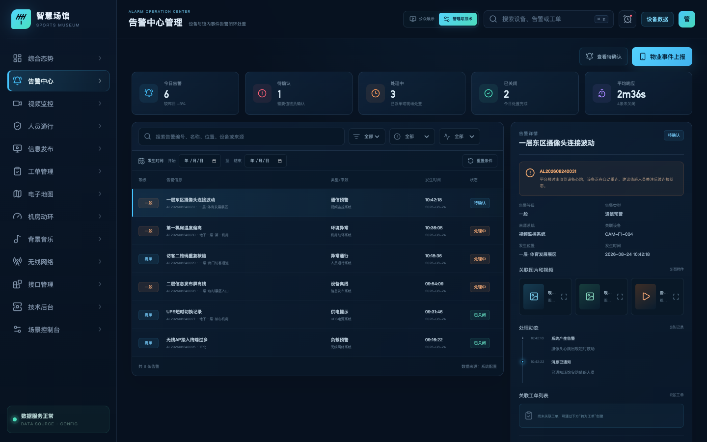
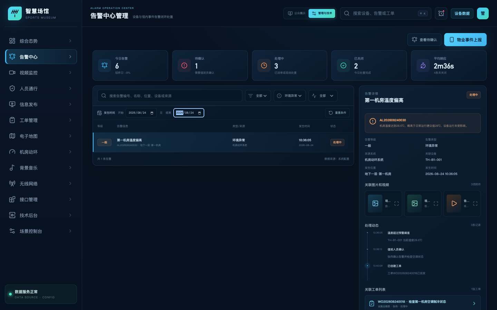
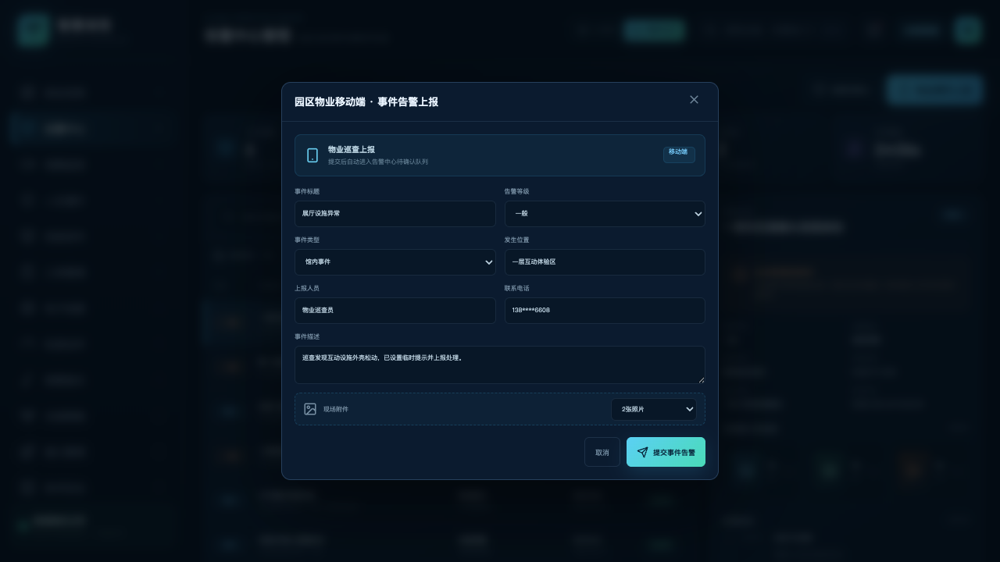
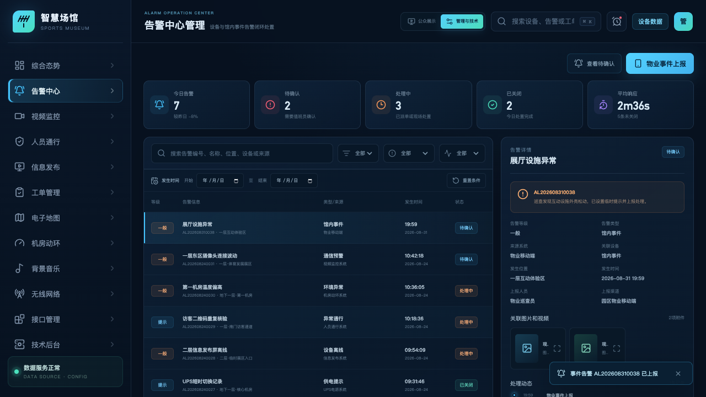
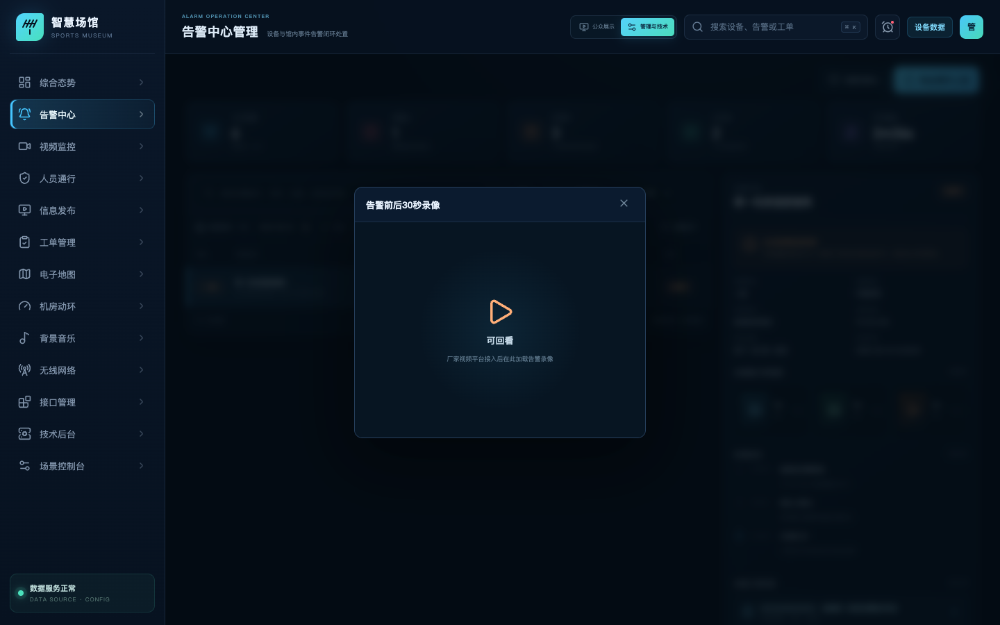
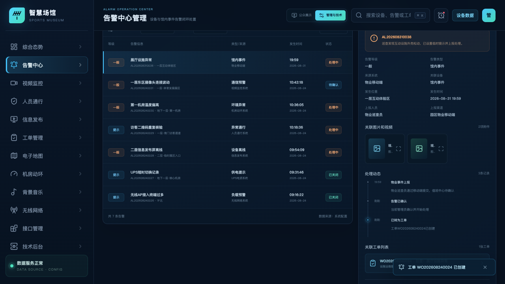
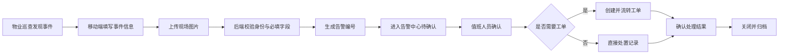

# 体育博物馆智慧化综合管理平台

## 告警中心管理功能说明

| 文档属性 | 内容 |
| --- | --- |
| 文档版本 | V1.0 |
| 编制日期 | 2026-08-31 |
| 对应模块 | 告警中心管理 |
| 页面路由 | `/alarms` |
| 适用对象 | 场馆管理人员、安保值班人员、设施运维人员、物业巡查人员、系统实施人员 |
| 当前阶段 | 功能与业务流程确认；真实设备及厂家接口待第二阶段联调 |

---

## 1. 建设目标

告警中心用于统一接收、展示和处置体育博物馆内的硬件设备告警与馆内事件告警。系统将来自视频监控、机房动环、人员通行、UPS、无线网络、信息发布等子系统的事件，与物业巡查人员主动上报的馆内事件汇聚到同一工作台，形成“发现—提醒—确认—派单—处置—关闭—留痕”的管理闭环。

本模块重点解决以下问题：

1. 不同子系统告警分散，值班人员无法统一查看。
2. 馆内设施、安全和服务事件缺少统一上报入口。
3. 告警确认、工单派发和处理结果之间缺少关联。
4. 图片、视频、处理动态等事件证据无法集中归档。
5. 后续追溯时缺少按编号、等级、类型、状态和时间组合查询的能力。

## 2. 需求符合性检查

| 序号 | 需求项 | 当前实现 | 结论 |
| ---: | --- | --- | --- |
| 1 | 硬件设备告警提醒 | 支持视频、动环、通行、UPS、无线网络、信息发布等来源的告警记录与状态统计 | 已具备 |
| 2 | 馆内事件告警提醒 | 支持“馆内事件、安全隐患、服务事件、环境异常”等事件类型 | 已具备 |
| 3 | 园区物业移动端上报 | 提供“物业事件上报”入口，可录入人员、电话、位置、描述和现场附件 | 已具备流程；真实移动端接口待联调 |
| 4 | 显示告警基本信息 | 显示编号、标题、等级、类型、来源、设备、位置、时间和状态 | 已具备 |
| 5 | 按告警编号查询 | 关键字输入框支持告警编号精确或模糊查询 | 已具备 |
| 6 | 按告警等级查询 | 支持一般、提示，展示范围限定为日常运维告警 | 已具备 |
| 7 | 按告警类型查询 | 支持按当前数据中的告警类型独立筛选 | 已具备 |
| 8 | 按告警状态查询 | 支持待确认、处理中、已关闭 | 已具备 |
| 9 | 按发生时间查询 | 支持开始日期、结束日期组合查询 | 已具备 |
| 10 | 展示告警详情 | 右侧详情区展示说明、来源、设备、位置、时间及上报信息 | 已具备 |
| 11 | 展示告警动态 | 按时间顺序记录产生、通知、确认、转工单和关闭等动作 | 已具备 |
| 12 | 展示工单列表 | 展示与当前告警关联的工单编号、标题、部门、处理人和状态 | 已具备 |
| 13 | 关联图片和视频 | 以附件卡片展示图片、视频及资源状态，支持点击预览 | 已具备；真实视频资源待接入 |

## 3. 页面总体说明

告警中心由四部分组成：

1. **快捷操作区**：查看待确认告警、发起物业事件上报。
2. **告警统计区**：展示今日告警、待确认、处理中、已关闭和平均响应时间。
3. **告警查询与列表区**：提供组合查询条件及告警结果列表。
4. **告警详情与处置区**：展示详情、附件、动态、工单，并提供确认、转工单、关闭操作。

*图 1　告警中心总体界面*

## 4. 告警统计

页面顶部统计卡片用于帮助值班人员快速识别当前工作量和风险状态。

| 指标 | 说明 |
| --- | --- |
| 今日告警 | 当前数据集中当日产生的告警总数 |
| 待确认 | 尚未由值班人员确认的告警数量 |
| 处理中 | 已确认、已派单或正在现场处置的告警数量 |
| 已关闭 | 已完成处置并由管理人员关闭的告警数量 |
| 平均响应 | 从告警产生到首次确认的平均时间；生产系统应由服务端实时计算 |

当前展示以日常运维类、低风险事件为主：一般告警采用橙色提醒，提示类告警采用蓝色提醒。告警颜色只用于辅助识别，最终处置规则应由等级、类型和场馆运行制度共同决定。

## 5. 告警查询

### 5.1 查询条件

| 查询条件 | 使用方式 |
| --- | --- |
| 告警编号/关键字 | 可输入告警编号、标题、位置、设备编号或来源系统 |
| 告警等级 | 全部、一般、提示 |
| 告警类型 | 根据当前告警数据动态生成，如设备离线、环境异常、异常通行、供电异常等 |
| 告警状态 | 全部、待确认、处理中、已关闭 |
| 开始日期 | 只显示发生日期大于或等于该日期的告警 |
| 结束日期 | 只显示发生日期小于或等于该日期的告警 |

多个条件之间采用“同时满足”的组合查询逻辑。例如，选择“环境异常”，并将开始、结束日期均设为 2026-08-24，系统只显示该日期内的环境异常告警。

*图 2　按告警类型与发生时间组合查询*

### 5.2 列表字段

告警列表展示以下字段：

- 告警等级；
- 告警标题；
- 告警编号；
- 发生位置；
- 告警类型；
- 来源系统；
- 发生日期及时间；
- 当前处理状态。

点击列表中的任意告警，右侧详情区同步切换到该告警。筛选条件变化后，详情区自动展示当前结果集中的第一条告警，避免列表与详情内容不一致。

## 6. 物业移动端事件上报

### 6.1 适用场景

物业巡查人员发现下列事件时，可通过移动端上报：

- 展陈设施松动、破损或运行异常；
- 消防通道占用、积水、异味等安全隐患；
- 观众服务、秩序维护类事件；
- 温湿度、照明、噪声等环境异常；
- 暂时无法由硬件系统自动发现的其他馆内事件。

### 6.2 上报字段

| 字段 | 必填 | 说明 |
| --- | :---: | --- |
| 事件标题 | 是 | 简要描述事件，如“展厅设施异常” |
| 告警等级 | 是 | 一般、提示 |
| 事件类型 | 是 | 馆内事件、设备故障、安全隐患、服务事件、环境异常 |
| 发生位置 | 是 | 具体楼层、展区或功能空间 |
| 上报人员 | 是 | 物业巡查人员姓名或工号 |
| 联系电话 | 是 | 便于值班中心联系核实 |
| 事件描述 | 是 | 现场情况、已采取措施及风险说明 |
| 现场附件 | 否 | 当前支持选择 0–3 张照片；生产系统应支持实际上传 |

*图 3　物业移动端事件告警上报表单*

### 6.3 提交结果

提交成功后，系统执行以下动作：

1. 自动生成格式为 `ALYYYYMMDDNNNN` 的告警编号。
2. 告警来源记录为“物业移动端”，上报渠道记录为“园区物业移动端”。
3. 新告警进入“待确认”状态，并置于列表顶部。
4. 现场照片登记为告警附件。
5. 处理动态新增“物业事件上报”记录。
6. 顶部待确认数量与今日告警数量同步更新。

*图 4　物业事件上报后自动进入待确认队列*

> 当前版本在 Web 页面内完成移动端上报流程验证。第二阶段应由物业移动端或企业微信/公众号调用后端事件上报接口，统一进行身份认证、附件上传、编号生成和消息通知。

## 7. 告警详情

### 7.1 基本信息

详情区展示：告警编号、描述、等级、类型、来源系统、关联设备、发生位置和发生时间。对于物业上报事件，还展示上报人员与上报渠道。

### 7.2 关联图片和视频

附件区按卡片展示图片和视频，内容包括文件名称、附件类型与资源状态。点击卡片可打开附件预览。

资源状态说明：

| 状态 | 说明 |
| --- | --- |
| 已上传 | 物业人员已提交现场照片 |
| 已归档 | 告警产生时的抓拍已归档到事件记录 |
| 可回看 | 已具备对应录像资源索引 |
| 资源待配置 | 业务逻辑已预留，但尚未取得真实视频流或录像地址 |

*图 5　告警关联视频资源预览*

真实视频接入后，建议在附件记录中保存平台编码、设备编码、通道号、录像开始时间、录像结束时间和回放地址，不应把厂家原始鉴权信息直接暴露给浏览器。

## 8. 告警动态

告警动态以时间轴记录事件全生命周期，典型节点包括：

1. 系统产生告警或物业提交事件；
2. 消息通知值班人员；
3. 值班人员确认告警；
4. 告警转为工单；
5. 工单分配及现场处理；
6. 管理人员确认恢复并关闭告警。

每条动态至少包含动作时间、动作名称和操作说明。生产系统还应记录操作人账号、所属部门、终端来源和操作前后状态，满足审计与责任追溯要求。

## 9. 告警与工单联动

### 9.1 转工单规则

值班人员点击“转为工单”后，系统基于当前告警创建处置工单，并自动带入：

- 告警标题和编号；
- 告警等级对应的工单优先级；
- 发生位置；
- 来源系统；
- 建议处理部门；
- 告警与工单关联关系。

若当前告警已有关联工单，系统不重复创建，并提示已有工单编号。

### 9.2 工单列表

详情区显示当前告警关联的全部工单，包括工单编号、标题、负责部门、处理人和状态。点击工单可进入工单管理模块查看完整流程。

*图 6　告警确认后转工单并形成动态留痕*

## 10. 业务流程

### 10.1 硬件设备告警流程

### 10.2 物业移动端上报流程

## 11. 状态流转

| 当前状态 | 可执行操作 | 下一状态 | 说明 |
| --- | --- | --- | --- |
| 待确认 | 确认告警 | 处理中 | 值班人员已知悉并开始处理 |
| 待确认 | 转为工单 | 处理中 | 创建工单并记录关联关系 |
| 处理中 | 转为工单 | 处理中 | 无工单时创建；已有工单时不重复创建 |
| 待确认/处理中 | 关闭告警 | 已关闭 | 应确认现场已恢复或风险已解除 |
| 已关闭 | 查看详情 | 已关闭 | 只读追溯，不再重复关闭 |

生产系统建议关闭告警时填写关闭原因；对需要重点关注的告警，可要求上传处置结果并由具备权限的人员复核。

## 12. 核心数据结构

### 12.1 告警主记录

| 字段 | 示例 | 说明 |
| --- | --- | --- |
| `id` | `AL202608310038` | 告警唯一编号 |
| `title` | 展厅设施异常 | 告警标题 |
| `level` | 一般 | 告警等级 |
| `type` | 馆内事件 | 告警类型 |
| `source` | 物业移动端 | 来源系统 |
| `location` | 一层互动体验区 | 发生位置 |
| `device` | 馆内事件 | 关联设备或事件对象 |
| `time` | `2026-08-31 18:34` | 发生时间 |
| `status` | 待确认 | 当前状态 |
| `description` | 巡查发现…… | 事件描述 |
| `reporter` | 物业巡查员 | 上报人员 |
| `reportChannel` | 园区物业移动端 | 上报渠道 |
| `relatedWorkOrder` | `WO202608240024` | 关联工单编号 |

### 12.2 附件记录

附件记录包含附件编号、类型、名称、采集时间和资源状态。生产系统还应增加对象存储地址、文件摘要、文件大小、上传人、访问权限和保留期限。

### 12.3 动态记录

动态记录包含动作时间、动作标题和详细说明。生产系统应扩展操作人 ID、操作来源、前状态、后状态和审计流水号。

## 13. 接口与系统边界

当前阶段已经完成页面、字段、数据模型和业务逻辑验证，但以下内容仍属于第二阶段：

1. 厂家 SDK、GB/T 28181、SNMP、Modbus 或其他真实协议告警接入。
2. 物业移动端的登录、鉴权、消息推送和真实附件上传。
3. 图片对象存储、视频录像检索和带权限的临时播放地址。
4. 服务端告警编号生成、数据库持久化、并发控制和重复告警合并。
5. 用户、角色、数据权限、操作审计和重点告警复核。
6. 短信、企业微信、公众号、App Push 等消息通知渠道。
7. 告警升级、超时催办、值班表和应急预案联动。

接口接入后应先转换为平台标准告警模型，再交给页面使用，不应在前端页面中直接解析不同厂家的原始数据结构。

## 14. 建议权限

| 角色 | 建议权限 |
| --- | --- |
| 物业巡查人员 | 新建馆内事件、上传附件、查看本人上报记录 |
| 场馆值班人员 | 查看告警、确认告警、补充动态、转工单 |
| 部门负责人 | 分派工单、调整等级、查看部门范围告警 |
| 系统管理员 | 配置类型、阈值、通知规则、接口与权限 |
| 审计人员 | 只读查看告警、动态、工单和操作日志 |

## 15. 验收建议

| 验收编号 | 验收场景 | 预期结果 |
| --- | --- | --- |
| ALM-01 | 按完整告警编号查询 | 只显示对应告警，详情同步一致 |
| ALM-02 | 组合选择等级、类型、状态和日期 | 结果同时满足全部条件 |
| ALM-03 | 提交物业馆内事件并附两张照片 | 自动生成编号，状态为待确认，照片进入附件区 |
| ALM-04 | 确认待确认告警 | 状态变为处理中，动态新增确认记录 |
| ALM-05 | 将告警转为工单 | 工单创建成功，告警动态和工单列表同步更新 |
| ALM-06 | 对同一告警重复转工单 | 不重复创建，提示已有工单 |
| ALM-07 | 点击图片与视频附件 | 打开对应预览并显示资源状态 |
| ALM-08 | 关闭处理中告警 | 状态变为已关闭，动态记录关闭操作 |
| ALM-09 | 在 1280×720 分辨率下操作 | 页面无横向溢出，查询和处置按钮可用 |
| ALM-10 | 检查浏览器控制台 | 无运行错误和警告 |

## 16. 当前验证结果

- 配置校验：通过；
- 7 项自动化配置契约测试：通过；
- TypeScript 编译与生产构建：通过；
- 告警类型与时间组合查询：通过；
- 物业事件上报与编号生成：通过；
- 告警确认、转工单、动态及工单列表联动：通过；
- 图片/视频附件预览：通过；
- 浏览器控制台：0 错误、0 警告。

---

**文档说明：** 本文档为告警中心模块的第一版功能说明，用于需求确认、演示验收和后续详细设计。经确认后，可基于本 Markdown 版本输出正式 Word 文档，并补充封面、修订记录、页眉页脚和正式编号体系。
