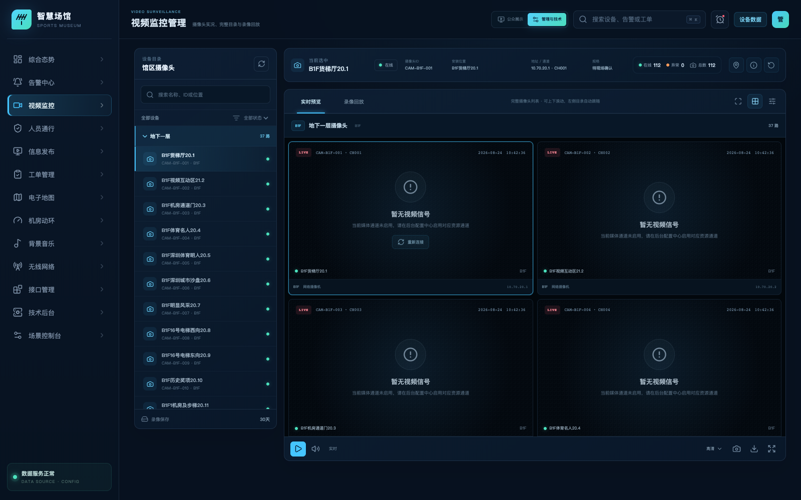
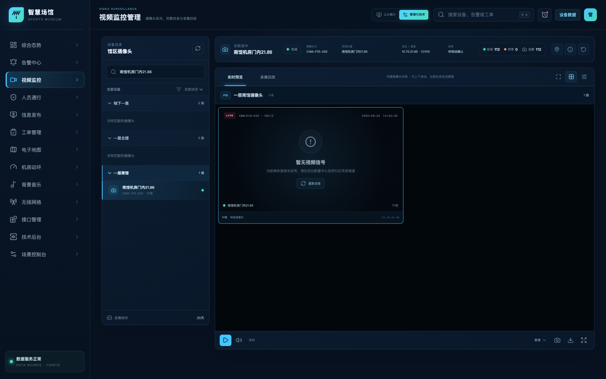
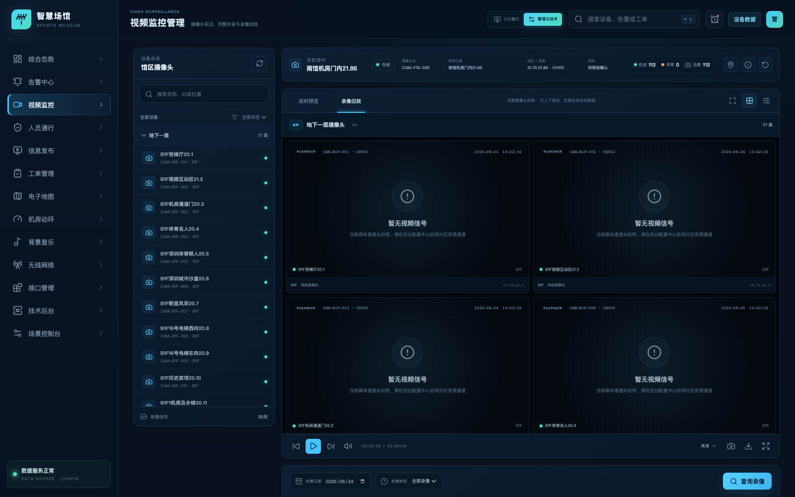

# 体育博物馆智慧化综合管理平台

## 视频监控管理功能说明

| 文档属性 | 内容 |
| --- | --- |
| 文档版本 | V1.0 |
| 编制日期 | 2026-08-31 |
| 对应模块 | 视频监控管理 |
| 页面路由 | `/video` |
| 适用对象 | 场馆管理人员、安保值班人员、视频巡查人员、系统管理员、接口实施人员 |
| 系统状态 | 验收版本；摄像头目录、实况预览、录像回放、后台配置与接口适配能力均纳入统一管理 |

---

## 1. 建设目标

视频监控管理用于统一查询体育博物馆馆区内的摄像头，并在浏览器中完成实况预览与录像回放。系统将摄像头资产、楼层区域、运行状态、视频通道和录像资源统一组织，使管理人员能够从“查找设备”快速进入“查看实况”或“检索录像”。

本模块重点实现以下管理目标：

1. 统一展示馆区全部摄像头，避免摄像头分散在不同设备平台中。
2. 支持按名称、摄像头 ID、区域、安装位置和运行状态快速定位设备。
3. 支持浏览器实况预览、画面布局切换和常用播放控制。
4. 支持按日期、录像类型查询录像，并通过时间轴选择回放片段。
5. 通过后台配置中心管理摄像头资产、接入协议、设备编码、媒体通道和授权参数。

## 2. 需求符合性检查

| 序号 | 需求项 | 平台实现 | 结论 |
| ---: | --- | --- | --- |
| 1 | 查询馆区所有摄像头 | 摄像头目录按地下一层、一层北馆和一层南馆分组，当前纳管 112 路现场摄像头 | 符合 |
| 2 | 摄像头关键字查询 | 支持按名称、摄像头 ID、区域和安装位置查询 | 符合 |
| 3 | 摄像头状态筛选 | 支持全部、在线、故障、离线状态筛选 | 符合 |
| 4 | 浏览器查看实况 | 提供实时预览模式、播放控制、画面布局、清晰度、音量、抓拍和全屏入口 | 符合 |
| 5 | 浏览器查看录像 | 提供录像回放模式，可按日期和录像类型检索并选择时间片段 | 符合 |
| 6 | 显示设备信息 | 显示摄像头 ID、名称、安装位置、地址、通道、分辨率、型号和状态 | 符合 |
| 7 | 设备目录联动 | 左侧目录选择摄像头后，右侧对应画面自动定位；右侧滚动时左侧目录同步跟随 | 符合 |
| 8 | 视频接入配置 | 后台提供 GB/T 28181 / SDK 接入实例，包含平台地址、认证方式、适配器和能力配置 | 符合 |
| 9 | 摄像头资产管理 | 后台支持摄像头资产查询、添加、编辑、删除及状态维护 | 符合 |
| 10 | 外部系统调用 | 开放接口层提供设备目录和设备状态查询能力，按应用身份与数据权限授权 | 符合 |

## 3. 系统架构设计

### 3.1 分层逻辑架构

*图 1　视频监控分层逻辑架构*

平台页面只使用统一摄像头模型和媒体服务，不直接解析厂家私有数据。摄像头目录、设备状态、实况地址和录像索引由适配器转换后提供给视频业务服务。

### 3.2 实况与录像处理框架

*图 2　实况预览与录像回放处理框架*

### 3.3 配置与安全边界

*图 3　视频配置与安全边界*

平台通过“摄像头资产 + 协议适配器 + 媒体通道 + 权限策略”管理现场差异。管理员可在后台配置协议类型、平台地址、设备编码、认证参数、录像保存期限和通道启停状态。浏览器只获取带权限且有有效期的资源地址，不接触厂家原始账号或密钥。

## 4. 页面总体说明

视频监控页面由四个主要区域组成：

1. **摄像头目录**：按楼层展示完整摄像头清单，并提供关键字和状态查询。
2. **当前设备信息**：在页面顶部集中展示选中摄像头的身份、位置、地址、通道、规格和状态统计。
3. **视频画面目录**：按楼层连续排列全部摄像头画面，默认采用田字格布局，也可切换为单列布局。
4. **播放与录像控制**：提供实况/回放模式切换、播放控制、录像检索、时间轴与片段选择。

*图 4　视频监控总体界面*

## 5. 摄像头目录与查询

### 5.1 馆区摄像头清单

系统当前纳管摄像头如下：

| 楼层区域 | 区域编码 | 摄像头数量 |
| --- | --- | ---: |
| 地下一层 | `B1F` | 37 路 |
| 一层北馆 | `F1N` | 49 路 |
| 一层南馆 | `F1S` | 26 路 |
| **合计** | — | **112 路** |

目录中的摄像头名称、编号、区域、安装位置、IP 地址和通道均来自统一配置。左侧目录与右侧画面列表使用同一摄像头 ID 建立关联，避免设备名称相近时发生误选。

### 5.2 查询条件

| 查询条件 | 查询范围 |
| --- | --- |
| 摄像头名称 | 支持完整名称或名称片段 |
| 摄像头 ID | 支持平台摄像头唯一编号 |
| 区域与位置 | 支持楼层、展区和具体安装位置 |
| 运行状态 | 全部、在线、故障、离线 |

多个查询条件同时生效。查询结果会同步更新左侧目录、楼层数量、右侧画面列表和当前选中摄像头；若原选中设备不在结果中，系统自动选中第一条匹配记录。

*图 5　按摄像头名称和安装位置查询*

### 5.3 目录与画面联动

- 点击左侧楼层名称，右侧列表滚动到对应楼层分段。
- 点击左侧摄像头，右侧画面自动定位并高亮。
- 在右侧连续滚动画面时，左侧当前设备和楼层状态自动跟随。
- 查询结果为空时，页面显示空结果提示，并保留查询条件供管理人员调整。

## 6. 实时预览

### 6.1 预览操作

管理人员进入页面后默认处于“实时预览”模式。选择摄像头并点击播放后，页面通过媒体服务申请该摄像头的实况资源，并在浏览器播放器中打开。

实时预览提供以下操作：

- 播放与暂停；
- 音量控制；
- 高清清晰度选择；
- 单列与田字格布局切换；
- 当前画面抓拍；
- 浏览器全屏显示；
- 设备重新连接；
- 地图定位和设备档案入口。

当媒体通道处于未启用状态时，画面区域明确显示通道状态，并提示管理员前往后台配置中心启用对应资源通道。该状态不会影响摄像头目录、查询、设备档案和通道配置管理。

### 6.2 多画面浏览

右侧画面区域不是仅显示当前楼层，而是按楼层分段连续展示全部匹配摄像头。默认田字格一次展示两列画面，适合巡查；单列布局扩大单个画面，适合核查设备信息。

## 7. 录像回放

### 7.1 录像查询

切换到“录像回放”后，系统显示录像查询与时间轴面板。查询条件包括：

| 条件 | 说明 |
| --- | --- |
| 摄像头 | 使用当前选中的摄像头 ID 和通道 |
| 录像日期 | 指定需要检索的自然日 |
| 录像类型 | 全部录像、定时录像、移动侦测、事件录像 |

*图 6　录像回放及时间轴入口*

### 7.2 时间轴与片段

录像查询结果按照 00:00–24:00 时间轴展示，不同颜色区分定时录像、移动侦测和事件录像。管理人员可点击时间轴或片段列表选择录像，使用播放、暂停、后退 10 秒和前进 10 秒进行查看。

录像类型会实际参与结果过滤。例如选择“事件录像”后，时间轴和片段列表只保留事件录像记录。

*图 7　按录像类型过滤录像片段*

### 7.3 录像操作

录像模式提供以下操作：

- 播放、暂停、前进 10 秒和后退 10 秒；
- 选择录像片段；
- 清晰度和音量控制；
- 录像画面抓拍；
- 创建录像下载任务；
- 浏览器全屏显示。

平台按照摄像头配置的录像保存期限管理查询范围。当前摄像头统一配置为保存 30 天，管理员可按设备、区域或存储策略调整。

## 8. 摄像头信息与运行状态

当前设备信息条展示以下内容：

| 字段 | 说明 |
| --- | --- |
| 摄像头名称/ID | 摄像头显示名称和平台唯一编号 |
| 安装位置 | 楼层、展区或具体安装点位 |
| IP 地址/通道 | 设备地址与视频通道编号 |
| 分辨率 | 当前配置的视频规格 |
| 运行状态 | 在线、故障或离线 |
| 在线统计 | 在线数量、异常数量和摄像头总数 |

运行状态用于帮助管理人员判断目录可用性。媒体通道启停状态与设备在线状态分别管理：设备在线表示摄像头资产处于运行状态；媒体通道启用表示平台已为该设备开放实况或录像资源访问。

## 9. 后台配置管理

### 9.1 摄像头资产

技术后台的“设备资产”功能支持：

- 按“视频监控”分类查询摄像头；
- 添加、编辑和删除摄像头资产；
- 配置设备编号、名称、厂家、型号、位置和 IP 地址；
- 配置接入协议、固件信息和运行状态；
- 查看设备最近心跳和资产详情。

### 9.2 视频接入实例

“硬件与协议”功能提供视频监控接入实例，配置范围包括：

| 配置项 | 内容 |
| --- | --- |
| 接入协议 | GB/T 28181 / 厂商 SDK |
| 接入地址 | SIP 平台地址或厂家服务地址 |
| 认证方式 | 平台编码、密码或厂家授权参数 |
| 适配器 | `VideoIntegrationAdapter` |
| 触发方式 | 事件推送及状态同步 |
| 能力范围 | 设备目录、实况取流、录像查询、告警订阅 |

管理员可保存接入参数并执行配置连通性检查。不同厂家通过独立接入实例管理，业务页面不因厂家协议不同而改变。

### 9.3 对外开放能力

平台通过开放接口层向授权应用提供设备目录和实时状态查询。调用方需配置应用身份、认证方式、访问范围和限流策略。实况与录像资源采用受控资源地址，按用户或应用权限签发。

## 10. 业务流程

### 10.1 摄像头查询流程

*图 8　摄像头查询流程*

### 10.2 实时预览流程

*图 9　实时预览流程*

### 10.3 录像回放流程

*图 10　录像回放流程*

## 11. 核心数据结构

### 11.1 摄像头主记录

| 字段 | 示例 | 说明 |
| --- | --- | --- |
| `id` | `CAM-B1F-001` | 摄像头唯一编号 |
| `name` | B1F货梯厅20.1 | 摄像头名称 |
| `floorId` | `B1F` | 楼层区域编码 |
| `position` | B1F货梯厅20.1 | 安装位置 |
| `status` | `online` | 运行状态 |
| `channel` | `CH001` | 视频通道编号 |
| `ip` | `10.70.20.1` | 设备地址 |
| `model` | 网络摄像机 | 设备型号 |
| `resolution` | 现场配置值 | 视频规格 |
| `recordingDays` | `30` | 录像保存期限 |
| `videoUrl` | 受控资源地址 | 媒体服务签发的播放资源 |

### 11.2 录像索引

录像索引至少包含摄像头 ID、通道号、录像日期、开始时间、结束时间、录像类型、存储位置、资源状态和访问权限。页面根据录像索引生成时间轴，不直接扫描存储文件。

## 12. 权限配置

| 角色 | 权限范围 |
| --- | --- |
| 场馆值班人员 | 查询摄像头、查看授权区域实况、查看设备状态 |
| 安保视频人员 | 查看实况、检索录像、抓拍和下载授权录像 |
| 部门负责人 | 查看部门数据范围内的实况与录像访问记录 |
| 系统管理员 | 管理摄像头资产、协议实例、媒体通道、保存策略和用户权限 |
| 审计人员 | 只读查看设备目录、资源访问和操作日志 |

## 13. 验收条目

| 验收编号 | 验收场景 | 预期结果 |
| --- | --- | --- |
| VID-01 | 打开视频监控页面 | 显示 112 路摄像头，并按三个楼层区域分组 |
| VID-02 | 输入完整摄像头 ID | 目录和画面只显示对应摄像头，顶部信息同步更新 |
| VID-03 | 输入摄像头名称或位置片段 | 返回所有匹配摄像头 |
| VID-04 | 选择在线、故障或离线状态 | 目录、楼层数量和画面同步过滤 |
| VID-05 | 点击左侧摄像头 | 右侧对应画面自动定位并高亮 |
| VID-06 | 向下滚动右侧画面 | 左侧目录跟随当前可见摄像头 |
| VID-07 | 切换田字格和单列布局 | 画面布局切换，摄像头信息保持一致 |
| VID-08 | 进入实时预览并点击播放 | 浏览器请求并播放当前摄像头实况资源；未启用通道显示明确状态 |
| VID-09 | 切换录像回放并选择日期 | 显示该摄像头当日录像时间轴与片段 |
| VID-10 | 选择事件录像 | 时间轴和片段列表只显示事件录像 |
| VID-11 | 点击录像片段并使用前进/后退 | 当前片段被选中，播放控制响应正常 |
| VID-12 | 点击全屏 | 浏览器进入全屏监控模式；无授权时显示明确提示 |
| VID-13 | 检查浏览器控制台 | 无运行错误和警告 |
| VID-14 | 执行配置、测试和生产构建 | 配置校验、自动化测试及构建全部通过 |

## 14. 当前验证结果

- 摄像头配置校验：112 路，数量与现场清单一致；
- 楼层分组：地下一层 37 路、一层北馆 49 路、一层南馆 26 路；
- 名称、ID、位置及状态查询：通过；
- 左侧目录与右侧画面联动：通过；
- 实时预览、播放控制及布局切换：通过；
- 录像日期和类型查询：通过；
- 录像类型过滤、时间轴和片段选择：通过；
- 浏览器全屏调用：已实现权限校验与状态反馈；
- 7 项自动化配置契约测试：通过；
- TypeScript 编译与生产构建：通过；
- 浏览器控制台：0 错误、0 警告。

---

**文档说明：** 本文档用于视频监控模块的功能验收、操作核对和系统交付说明。现场视频平台、摄像头和录像资源的启用状态，以后台配置中心中的设备资产、协议实例、授权参数、媒体通道和权限策略为准。
