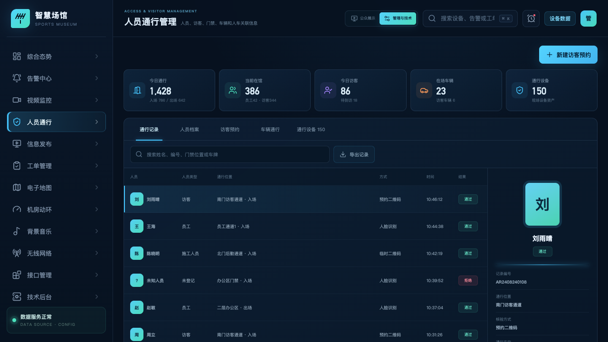
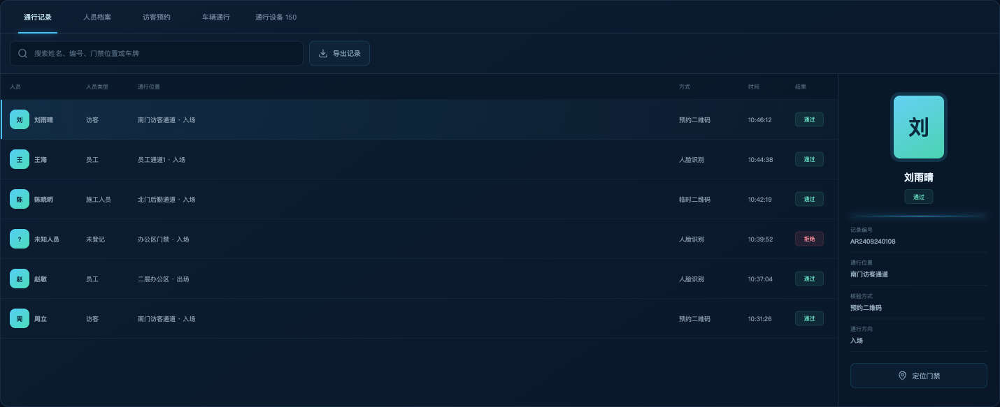
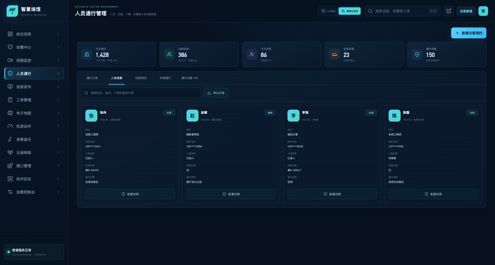
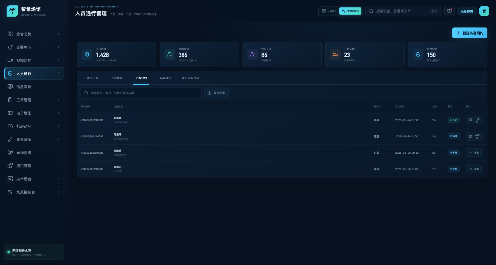
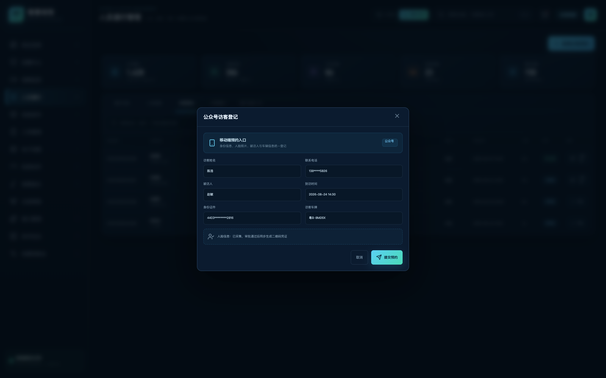
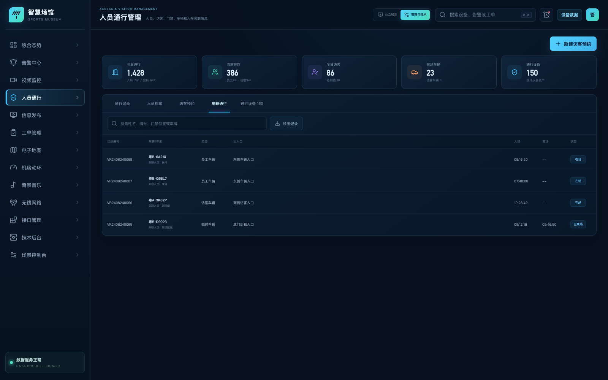
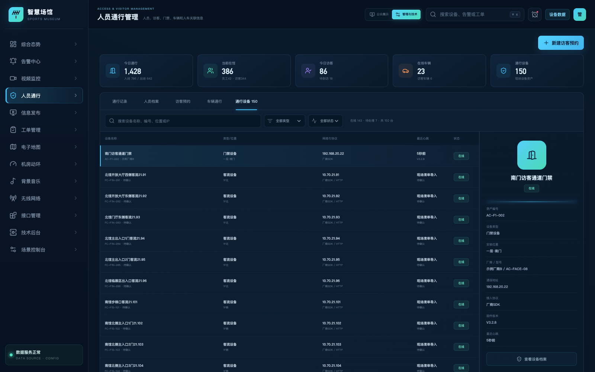

# 体育博物馆智慧化综合管理平台

## 人员通行管理功能说明

| 文档属性 | 内容 |
| --- | --- |
| 文档版本 | V1.0 |
| 编制日期 | 2026-08-31 |
| 页面路由 | `/access` |
| 适用对象 | 安保、前台、人事、车场和系统管理人员 |
| 系统状态 | 验收版本；人员、访客、门禁、车辆及通行凭证统一管理 |

## 1. 建设目标

本模块建立人员、照片、车辆、门禁权限和通行记录的统一档案，并将外部访客的移动端登记、审批、人脸采集、二维码生成、到访核验和离场归档纳入同一流程。

## 2. 需求符合性

| 需求项 | 平台实现 | 结论 |
| --- | --- | --- |
| 人员进出记录 | 显示人员、位置、方向、凭证、时间和结果，可查询并导出 | 符合 |
| 人员基础信息与照片 | 人员档案展示部门、岗位、联系方式、人脸照片状态和权限 | 符合 |
| 人车关联 | 人员档案和车辆记录双向展示关联人员与车牌 | 符合 |
| 公众号访客登记 | 移动端登记表覆盖身份、被访人、时间、人脸和车辆信息 | 符合 |
| 人脸或二维码入园 | 审批通过后生成限时二维码，同时保留人脸核验方式 | 符合 |
| 门禁设备管理 | 按类型、状态和关键字查询设备，展示 IP、协议、位置和心跳 | 符合 |

## 3. 系统架构

* 图 1　人员通行分层架构

平台通过统一人员 ID、访客单号、车辆 ID 和设备 ID 关联数据。后台可配置公众号入口、人脸服务、二维码规则、门禁协议实例及数据保留周期。

## 4. 功能说明

* 图 2　人员通行管理总体界面

### 4.1 通行记录

支持按姓名、编号、门禁位置和车牌检索。点击记录后显示人员照片、记录编号、核验方式、通行方向和定位入口。

* 图 3　通行记录列表与单条记录详情

界面左侧为记录清单，统一展示人员类型、通行位置、核验方式、时间和结果；右侧详情区随选中记录联动，补充记录编号、方向和门禁定位入口。验收人员可从一条记录直接核对“人员—凭证—位置—时间—结果”的完整链路，无需跨页面拼接信息。

### 4.2 人员档案与人车关联

人员档案统一管理照片/人脸状态、所属部门、岗位、通行权限和关联车辆。车辆记录包含车牌、车主、出入口、入场与离场时间。

* 图 4　人员基础档案、照片状态与关联车辆

档案页采用清单化管理方式，管理人员可从人员编号、部门、岗位、联系方式、照片/人脸状态、权限组和关联车牌等维度进行核对。选中人员后可查看其有效期和权限范围，用于员工入转调离、临时人员授权及车辆绑定管理。

### 4.3 访客预约

* 图 5　访客预约与入馆流程

凭证包含访客身份、有效时段、可通行区域和使用状态。二维码限本人、限时使用，核验后自动失效；人脸凭证按同一预约规则授权。

* 图 6　访客预约清单与审批状态

预约清单突出预约编号、访客及单位、被访人、到访时间、人数、当前状态和可执行操作。已通过记录可查看二维码，待审批记录显示审批入口，使前台和被访部门能够快速区分“待审批、已通过、已入场”等业务状态。

## 5. 业务角色与权限

| 角色 | 主要职责 | 关键权限 |
| --- | --- | --- |
| 安保值班人员 | 查看实时通行、异常核验和设备状态 | 查询通行记录、定位门禁、处理异常 |
| 前台接待人员 | 管理访客预约、到访核验和凭证发送 | 审批访客、查看二维码、补充来访信息 |
| 人事管理人员 | 维护员工档案、照片和通行权限 | 新增/编辑人员、配置权限、关联车辆 |
| 车场管理人员 | 维护车辆档案及出入口记录 | 查询车辆、人车绑定、处理车牌异常 |
| 系统管理员 | 维护设备、协议、字段映射和业务规则 | 设备增删改、接口配置、日志审计 |

平台采用“角色权限 + 数据范围”的控制方式。例如，前台可处理访客业务，但不默认获得全部员工人脸信息的导出权限；设备管理员可维护协议参数，但不代表可修改人事档案。

## 6. 人员档案详细说明

### 6.1 基础信息

人员档案以人员编号为唯一标识，建议包含姓名、所属部门、岗位、联系方式、人员类型、在职状态、有效期、通行权限组和关联车辆。当人员离职或调岗时，系统可通过状态和有效期统一停用原权限，避免在多个门禁子系统重复处理。

### 6.2 照片与人脸信息

人员照片用于档案识别，人脸特征用于核验凭证，两者在业务上关联、在存储和权限上分类管理。平台记录人脸采集状态、采集时间、质量校验结果、授权范围和失效时间，不在普通列表中暴露原始特征数据。

### 6.3 通行权限

通行权限由区域、时间段、凭证方式和特殊限制组成。例如，普通员工可在开馆时间通行办公区，运维人员可进入设备区，访客仅可在预约时段通过指定入口。后台修改权限组后，通过适配器将差异下发至相关设备。

## 7. 访客全流程操作说明

* 图 7　访客移动端登记与凭证信息采集界面

登记界面以移动端业务逻辑组织字段，包含访客姓名、联系方式、身份证件、被访人、到访时间和访客车牌，并明确显示人脸信息采集状态。提交后，申请进入统一审批队列；审批通过时由凭证服务生成二维码及人脸通行授权。

1. 访客进入移动端登记入口，填写姓名、联系方式、证件、被访人、到访时间及来访事由。
2. 如驾车到访，同步登记车牌号、车辆类型和预计离场时间，建立临时人车关联。
3. 访客按页面指引完成人脸照片采集。平台检查清晰度、面部完整性和重复登记情况。
4. 申请提交后进入待审批队列，被访人或授权管理员核对访客身份和来访时段。
5. 审批通过后，平台生成人脸权限和限时二维码，并通过配置的消息通道发送。
6. 到馆时，访客可使用人脸或二维码核验。通过后生成入场记录，重复或过期凭证会被拒绝并保留原因。
7. 访客离场后，凭证失效，车辆出场记录与访客单号统一归档。

## 8. 通行记录与异常处理

* 图 8　车辆出入口记录与关联人员

车辆页按记录编号、车牌/车主、车辆类型、出入口、入场时间、离场时间和状态呈现。车牌下方直接显示关联人员，方便核验访客车辆、员工车辆和临时车辆的归属及在场状态。

### 8.1 通行记录字段

| 字段组 | 主要字段 | 用途 |
| --- | --- | --- |
| 身份信息 | 记录编号、人员/访客编号、姓名、人员类型 | 确定通行主体 |
| 场所信息 | 设备 ID、门禁名称、所在位置、通行方向 | 还原现场路径 |
| 核验信息 | 凭证方式、核验时间、结果、失败原因 | 分析通行结果 |
| 关联信息 | 访客单号、车辆 ID、告警编号、现场图片 | 完成业务追溯 |

### 8.2 常见异常

- 凭证过期：拒绝通行，提示联系前台核实预约时段。
- 二维码重复使用：记录重复核验事件，必要时进入告警中心。
- 人脸比对失败：不直接放行，由前台核对证件后选择合规的备用凭证。
- 无权限区域：记录尝试设备、时间和权限组，用于安保复核。
- 设备离线：页面标识设备状态，转由备用通道或现场值班人员处理。

## 9. 设备管理与协议适配

* 图 9　门禁、闸机、车道与客流设备管理界面

通行设备清单纳管门禁控制器、人脸识别终端、二维码读卡器、闸机、客流设备和车道设备。每台设备保留资产编号、类型、厂商、型号、位置、IP 地址、接入协议、固件版本、在线状态和最后心跳。

协议适配器将不同厂商的人员下发、权限下发、记录上报和设备状态转换为平台标准模型。后台可按实例启用协议能力，设置请求地址、认证参数、超时、重试、时间同步和字段映射，页面功能不依赖某一厂家数据结构。

## 10. 数据安全与审计

- 身份证件、手机号和车牌可按角色进行脱敏展示，导出操作需要独立权限。
- 人脸数据与业务档案分类存储，对查看、采集、更新、下发和删除操作记录审计日志。
- 访客凭证按预约时段生效，访客单结束后自动失效，避免长期权限残留。
- 对外系统通过应用身份和数据范围获取信息，接口访问带有请求编号、调用方和处理结果。

## 11. 后台配置与安全

- 设备资产：门禁、闸机、客流设备和车道设备的名称、位置、IP、协议和状态可配置。
- 凭证策略：可设置人脸、二维码、卡片和车牌的适用范围、有效期及失效规则。
- 隐私保护：身份证件与联系方式脱敏展示，人脸数据按权限访问并记录操作日志。
- 对外接口：为其他系统提供受权的人员、访客、车辆和通行记录查询能力。

## 12. 验收要点

1. 五个业务页签可正常切换，查询与筛选结果正确。
2. 访客可完成登记、审批、二维码查看与发送操作。
3. 人员照片、人脸状态、权限和车辆关联信息可查看。
4. 通行记录具备明确的现场位置、核验方式、方向和结果。
5. 页面无水平溢出，浏览器控制台无错误。

### 12.1 建议验收场景

| 场景 | 操作 | 预期结果 |
| --- | --- | --- |
| 员工入场 | 在人员档案查看权限，再查询对应通行记录 | 人员、位置、方向和凭证一致 |
| 访客预约 | 新建访客、审批并查看二维码 | 状态从待审批转为已通过，凭证可发送 |
| 人车关联 | 在人员档案和车辆记录分别查询同一车牌 | 双向关联结果一致 |
| 异常凭证 | 查看重复二维码或拒绝记录 | 结果、原因、时间和设备可追溯 |
| 设备查询 | 按类型、状态和位置筛选 | 清单、数量和详情联动更新 |
