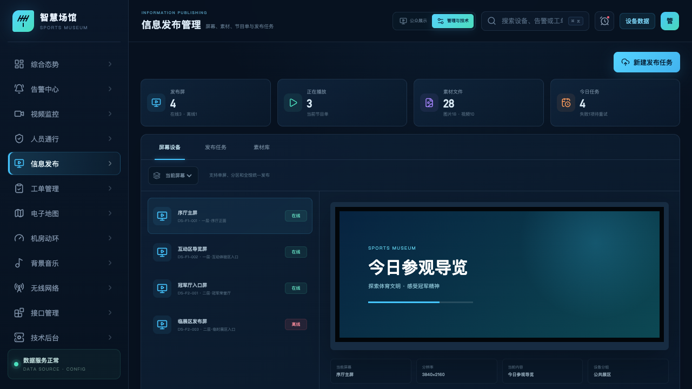
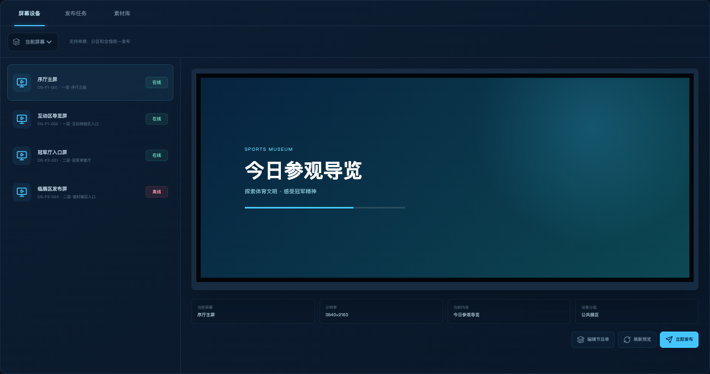
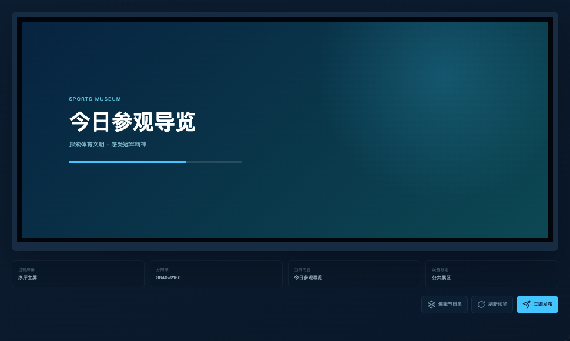
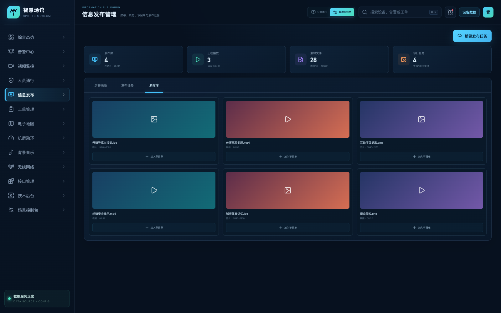
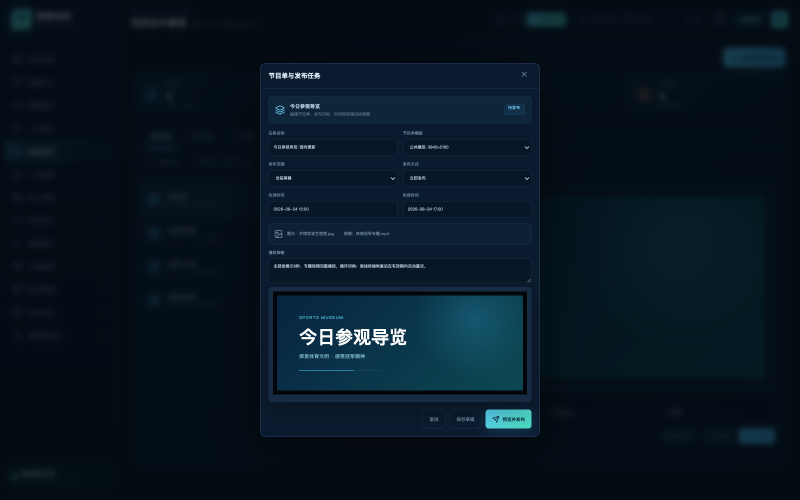
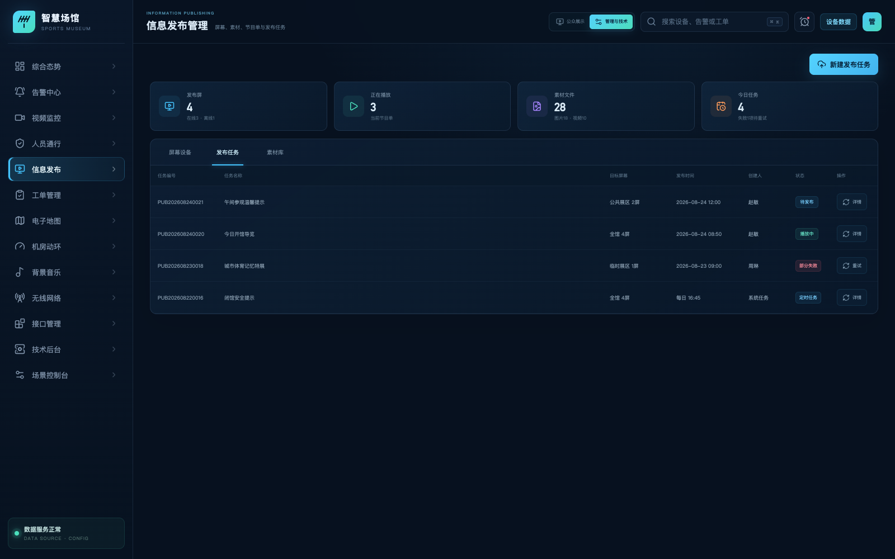

# 体育博物馆智慧化综合管理平台

## 信息发布管理功能说明

| 文档属性 | 内容 |
| --- | --- |
| 文档版本 | V1.0 |
| 编制日期 | 2026-08-31 |
| 页面路由 | `/publishing` |
| 适用对象 | 宣传、展陈、运营值班和系统管理人员 |
| 系统状态 | 验收版本；屏幕资产、素材、节目单与发布任务统一管理 |

## 1. 建设目标

平台用于统一管理发布屏设备、运行状态、图片/视频素材、节目单和发布记录，支持单屏、分区和全馆统一发布。

## 2. 需求符合性

| 需求项 | 平台实现 | 结论 |
| --- | --- | --- |
| 发布屏设备信息 | 显示编号、名称、位置、分辨率、分组和最后同步时间 | 符合 |
| 运行状态 | 展示在线/离线、当前内容和发布结果 | 符合 |
| 统一或分区编辑 | 支持当前屏幕、当前分区和全部屏幕三种目标范围 | 符合 |
| 发布图片和视频 | 素材库分类展示图片与视频，可加入节目单 | 符合 |
| 任务记录 | 记录任务编号、目标屏幕、时间、创建人和状态，支持重试 | 符合 |

## 3. 系统架构

* 图 1　信息发布功能架构

## 4. 功能说明

* 图 2　发布屏、虚拟预览和发布范围

### 4.1 屏幕资产与状态

屏幕列表展示设备编号、位置和运行状态。选中屏幕后，右侧同步展示虚拟播放画面、分辨率、当前内容和设备分组。

* 图 3　发布屏清单、分区状态与快捷发布入口

管理面板将设备清单、在线状态、发布范围和任务入口集中在同一工作区。左侧按楼层/区域展示发布屏及状态，选中设备后右侧即时联动；顶部可切换屏幕管理、发布任务和素材库，降低值班人员在多层菜单间查找的成本。

* 图 4　选中屏幕的播放预览、设备规格和运行状态

局部详情区用于验收单台屏幕：预览窗口体现版式和当前内容，设备信息区显示设备编号、安装位置、分辨率、所属分组、在线状态及最近同步结果。界面同时保留“当前屏幕、当前分区、全部屏幕”发布范围，使操作目标在提交前清晰可见。

### 4.2 素材与节目单

素材库统一管理图片、视频及基本属性。节目单编辑器负责布局区域、播放顺序、时长和发布目标；不同分辨率的终端可通过模板参数适配。

### 4.3 发布流程

* 图 5　内容发布业务流程

## 5. 业务角色与权限

| 角色 | 主要职责 | 可执行操作 |
| --- | --- | --- |
| 内容编辑 | 维护图片、视频和节目单 | 上传素材、编辑节目单、提交审核 |
| 展陈/宣传管理人员 | 确认展示内容、播放区域与时间 | 预览、审核、定时发布、停止任务 |
| 运营值班人员 | 处理临时通知和发布异常 | 即时发布、重试失败任务、查看回执 |
| 系统管理员 | 维护屏幕资产、分组和 SDK 实例 | 设备增删改、协议参数、权限和日志审计 |

内容编辑权和最终发布权可分离。重要公告或全馆发布任务可按后台规则要求审核，单屏日常节目则可在授权范围内直接执行。

## 6. 屏幕资产管理

### 6.1 设备档案

发布屏档案以设备编号为唯一标识，包含屏幕名称、安装位置、终端类型、分辨率、方向、播放能力、设备分组、在线状态、当前内容和最后同步时间。屏幕位置建议精确到楼层、展区和安装面，方便离线时快速到场处理。

### 6.2 分组与分区

同一屏幕可归属于地理分区和业务分组。例如，“一层公共展区”用于日常导览，“应急通知屏”可跨楼层组合。发布时使用分组 ID 选择目标，不依赖人工勾选每台设备，减少错发和漏发。

### 6.3 状态判定

在线状态由心跳时间、终端返回状态和通信超时规则综合判定。屏幕离线不会删除任务，平台保留目标和内容版本，按配置的重试策略重新执行，并在回执中区分全部成功、部分失败和全部失败。

## 7. 素材库管理

* 图 6　素材库分类、缩略图和文件属性界面

素材库采用卡片与属性结合的样式，图片展示缩略图、尺寸和文件大小，视频展示封面、时长、编码和分辨率。类型筛选、主题检索和审核状态用于快速定位素材；选中素材后可加入节目单，并保留素材编号和版本引用关系。

### 7.1 素材类型与属性

| 素材类型 | 核心属性 | 校验重点 |
| --- | --- | --- |
| 图片 | 文件名、尺寸、比例、大小、格式、缩略图 | 分辨率、色彩模式和终端比例 |
| 视频 | 时长、分辨率、编码、帧率、音频轨、封面 | 编解码兼容性、文件完整性和播放性能 |
| 模板 | 画布尺寸、区域布局、字体、背景、动画规则 | 区域边界、字体可用性和多分辨率适配 |

素材上传后生成唯一编号和版本信息。内容替换时保留历史版本，已经发布的任务继续引用原版本，避免修改素材后导致正在播放的节目内容不可追溯。

### 7.2 素材检索与复用

建议按素材类型、主题、展区、创建人、上传时间和审核状态检索。素材加入节目单时只建立引用关系，不复制原文件，便于统一更新和空间管理。

## 8. 节目单编辑与预览

节目单由名称、版本、画布尺寸、区域布局、素材顺序、播放时长、转场规则和发布范围组成。编辑时可先选择与屏幕分辨率匹配的模板，再将图片或视频放入对应区域。

预览环节用于检查画面裁切、文字可读性、素材时长和切换顺序。对多屏或分区任务，平台根据每台屏幕的规格生成目标列表，并在发布前提示不兼容的终端。

* 图 7　节目单模板、素材编排、发布范围和时段设置

编辑器将一次发布所需的关键设置放在同一表单：任务名称、节目单模板、发布范围、立即/定时方式、生效和失效时间、图片与视频素材、循环策略及虚拟预览。操作者可保存草稿，也可在确认预览后直接发布；提交结果进入任务清单并形成回执。

## 9. 发布任务详细说明

* 图 8　发布任务、目标范围、执行时间和终端回执

任务清单面向日常值守和验收追溯，支持按任务名称、编号和状态检索。每条任务显示节目单、目标范围、创建人、计划时间、当前状态和完成进度；部分失败任务可展开目标设备回执并仅重试失败终端。

### 9.1 任务字段

发布任务至少记录任务编号、任务名称、节目单版本、目标类型、目标屏幕清单、计划时间、有效期、创建人、审核人、当前状态和终端回执。单屏、分区和全馆三种发布方式共用同一任务模型，差别仅在目标解析规则。

### 9.2 任务状态

* 图 9　发布任务状态流转

“下发成功”与“已开始播放”应区分记录。平台根据厂家回执能力映射任务状态；对未提供播放回执的终端，使用下发结果、设备心跳和当前节目标识进行综合判定。

## 10. 异常处理与追溯

- 终端离线：记录最后心跳和失败原因，目标屏幕进入重试队列。
- 素材不兼容：发布前拦截并标识编码、分辨率或文件完整性问题。
- 部分失败：保留成功屏幕的回执，仅对失败目标重试，避免重复切换正常屏幕。
- 任务过期：已超过有效期的临时通知不再自动重试，防止过时内容恢复播放。
- 内容回滚：需要撤回时，使用上一个已确认的节目单版本重新发布，并记录回滚原因。

## 11. 后台配置与接口

- 可配置屏幕名称、位置、分组、分辨率、设备编码和在线心跳规则。
- 可配置厂家 SDK 实例、认证参数、超时重试和任务回执映射。
- 对外接口可按应用身份开放屏幕状态、节目单和发布任务查询能力。
- 接口实例的启用状态、厂家类型和账号密钥由技术后台统一维护。

## 12. 验收要点

1. 屏幕设备、发布任务和素材库可正常切换。
2. 单屏、分区和全馆三种发布范围会正确写入任务目标。
3. 图片和视频素材可选入节目单，发布前可预览。
4. 离线终端的发布结果可识别并进入重试处理。
5. 页面和浏览器控制台无错误。

### 12.1 建议验收场景

| 场景 | 操作 | 预期结果 |
| --- | --- | --- |
| 单屏发布 | 选择一台在线屏幕并立即发布 | 任务目标为单屏，状态转为播放中 |
| 分区发布 | 选择当前分区发布节目单 | 分区内目标屏幕被统一解析和记录 |
| 全馆发布 | 选择全部屏幕发布 | 任务中显示全馆目标数量和分屏回执 |
| 离线屏幕 | 向包含离线终端的分区发布 | 任务显示部分失败，失败屏可单独重试 |
| 素材复用 | 将图片和视频加入节目单并预览 | 类型、尺寸、时长和播放顺序正确 |
