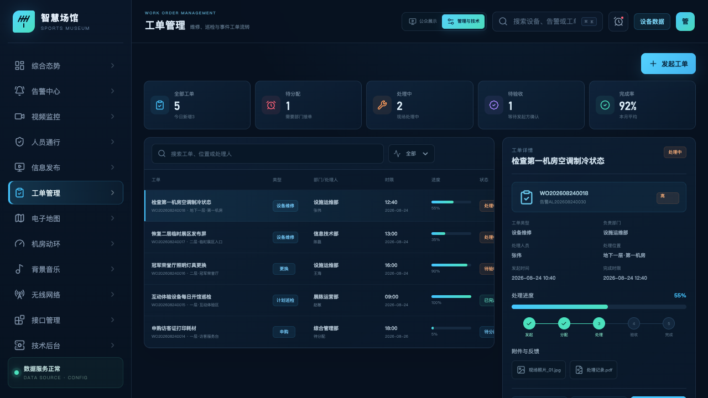
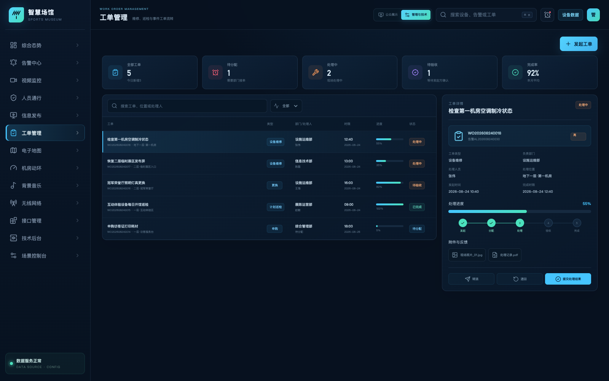
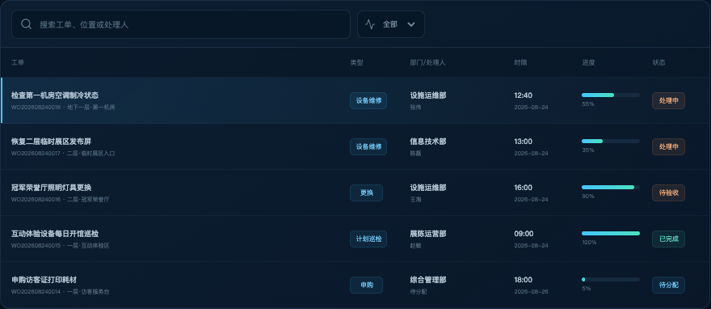
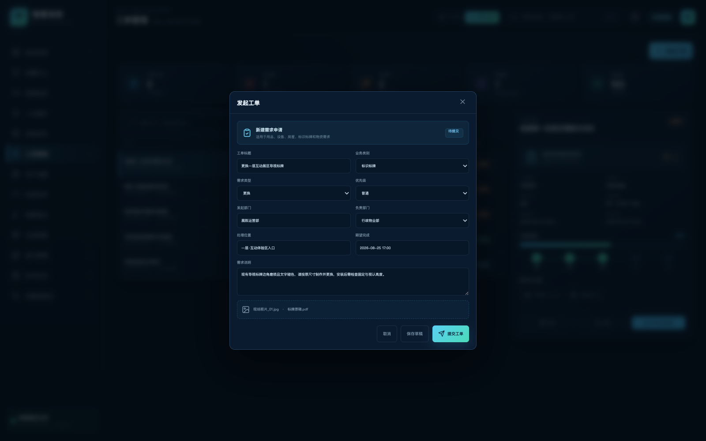
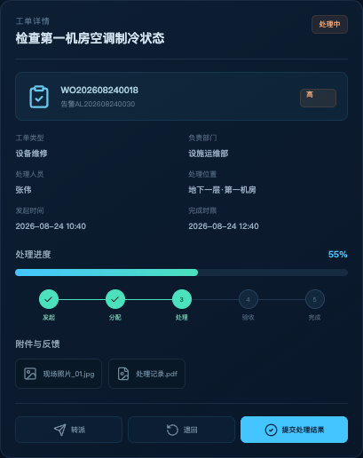
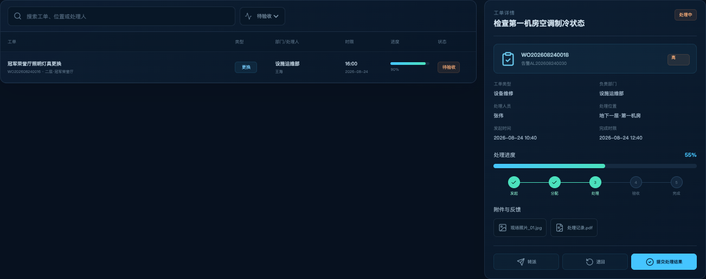

# 体育博物馆智慧化综合管理平台

## 工单管理功能说明

| 文档属性 | 内容 |
| --- | --- |
| 文档版本 | V1.0 |
| 编制日期 | 2026-08-31 |
| 页面路由 | `/workorders` |
| 适用对象 | 各业务部门、设施运维、安保、物资采购和工单管理人员 |
| 系统状态 | 验收版本；需求申请、分配、执行、验收、反馈与计划统一管理 |

## 1. 建设目标

工单中心覆盖用品、设备、房屋、标识标牌和物资的维护、更换、申购及巡检需求，支持部门或员工发起，并通过可配置流程完成分配、执行、验收、反馈、转派和退回。

## 2. 需求符合性

| 需求项 | 平台实现 | 结论 |
| --- | --- | --- |
| 多类资产/物资申请 | 工单类型可配置为维护、更换、申购、巡检和事件处置 | 符合 |
| 部门或个人发起 | 工单记录发起来源、发起人、负责部门和处理人 | 符合 |
| 部门流转分配 | 支持待分配、处理中、待验收、已完成流转和转派 | 符合 |
| 完成后反馈/重新分配 | 待验收节点由发起方确认，可验收、退回或转派 | 符合 |
| 计划发起、执行和完成 | 计划规则生成工单，通过时限、进度和状态记录执行结果 | 符合 |

## 3. 系统架构

* 图 1　工单管理分层架构

## 4. 功能说明

* 图 2　工单列表、详情与处理进度

工单列表可按编号、标题、类型、位置、处理人和状态查询。详情区展示优先级、来源、负责部门、处理人、时限、附件、处理进度和当前节点。

* 图 3　工单统计、状态筛选、列表和详情工作区

工作区上方汇总工单总量、处理中、待验收和逾期等状态；中部提供关键字、状态和分类筛选；下方采用“列表 + 详情”布局。管理人员选择任意工单即可查看责任部门、处理人、位置、时限、过程动态及附件，不需要离开当前清单。

* 图 4　按编号、标题、位置、处理人和状态查询工单

清单行突出工单编号、标题、类别、位置、负责人、优先级和当前节点。筛选结果与右侧详情联动，适合值班调度人员连续处理多条工单，也便于验收时核对不同业务分类和流程状态。

### 4.1 业务流程

* 图 5　标准工单流程

验收不通过时，发起方填写反馈并退回处理节点；责任部门或处理人不适合时，可在保留流转记录的前提下转派。

### 4.2 计划性事件

后台可配置巡检、保养、更换等计划的周期、生效日期、执行部门和完成时限。计划到期自动形成工单，执行过程使用同一状态模型，便于统计计划完成率和逾期情况。

## 5. 工单分类与适用范围

| 业务类别 | 典型对象 | 常见需求 | 建议责任部门 |
| --- | --- | --- | --- |
| 用品与物资 | 办公用品、清洁用品、消耗品 | 补充、更换、申购 | 行政或物资管理部门 |
| 设备设施 | 机电、弱电、多媒体和展项设备 | 维修、巡检、保养、更换 | 设施运维部门 |
| 房屋与公区 | 墙面、地面、照明、给排水 | 修缮、排查、恢复 | 工程或物业部门 |
| 标识标牌 | 导视牌、提示牌、安全标识 | 新增、更换、内容修订 | 展陈、行政或安保部门 |
| 宿舍物资 | 家具、床品、电器和日常物资 | 维护、更换、申购 | 后勤管理部门 |

工单类型与责任部门由后台字典和路由规则维护。新增业务类别时，无需改变工单列表和状态模型，仅需配置名称、字段、默认部门、时限和审批规则。

## 6. 角色与职责

| 角色 | 职责 | 主要操作 |
| --- | --- | --- |
| 发起人/发起部门 | 说明需求、提供位置和附件、验收结果 | 发起、补充、查询、验收、退回 |
| 受理/调度人员 | 判断责任部门、优先级和完成时限 | 分配、转派、调整时限、升级 |
| 处理人员 | 到场处理并提交过程、材料和结果 | 接单、开始、暂停、反馈、提交结果 |
| 业务管理人员 | 统计工单、跟踪逾期与处理质量 | 查看全部工单、导出、督办、报表统计 |
| 系统管理员 | 维护类型、流程、组织和接口 | 配置规则、权限、通知和对外接口 |

## 7. 工单发起与受理

### 7.1 发起信息

工单发起时应填写业务类型、标题、问题描述、发生位置、紧急程度、期望完成时间、申请事项和联系人，并可关联设备、资产、告警编号、图片、视频或文档。发起部门与个人申请使用同一数据模型，发起主体字段用于区分责任和验收人。

* 图 6　维护、更换、申购和巡检需求发起界面

发起表单按业务实际设置标题、业务类别、需求类型、优先级、发起部门、负责部门、发生位置、期望完成时间、问题描述和附件。表单支持保存草稿或直接提交，提交后根据类别与位置匹配负责部门；无法匹配时进入待分配队列。

### 7.2 自动路由

平台根据工单类型、对象所在区域、设备类别、优先级和值班表选择默认负责部门。无法匹配时进入待分配队列，由调度人员人工选择部门和处理人，不会因缺少规则而丢失工单。

### 7.3 优先级和时限

优先级可影响提醒频率、首次响应时限和完成时限。平台同时记录计划时限和实际时间，用于计算响应时长、处理时长和逾期情况。修改时限时需记录原因和操作人。

## 8. 分配、处理与协同

* 图 7　单张工单详情、责任信息和流程操作区

详情面板是工单处置的主要入口。除基本字段外，界面显示当前责任部门、处理人、完成时限、进度和流程动态，并根据当前节点提供接单、反馈、转派、提交结果等操作。每次操作写入时间、人员和意见，形成连续的审计轨迹。

### 8.1 分配与接单

调度人员分配工单后，系统向处理人或处理组发送通知。处理人接单后，工单从“待分配”进入“处理中”，同时记录接单时间和当前责任人。对需要多部门协同的任务，主工单保留总责任部门，可通过子任务或协同记录跟踪其他部门工作。

### 8.2 处理过程记录

处理人可分次提交到场时间、检查情况、处理措施、使用材料、当前进度、预计完成时间和现场附件。每次更新形成带时间和操作人的动态，供发起方与管理人员跟踪。

### 8.3 转派与升级

转派用于调整当前责任部门或处理人。系统保留转出方、接收方、时间和原因，不覆盖历史责任。工单接近逾期、多次退回或优先级提升时，可按规则通知上级管理人员进行升级处理。

## 9. 验收、反馈与重新分配

* 图 8　待验收工单清单与验收处理状态

状态筛选为“待验收”后，页面只保留已提交处理结果、等待发起方确认的工单。验收人员可查看处理说明和附件，选择通过、退回整改或重新分配；退回和转派不会覆盖原处理结果，而是在工单动态中追加新节点。

处理人提交结果后，工单进入“待验收”。发起人或发起部门核对实际结果、附件和处理说明，选择以下操作：

- 验收通过：记录验收人、时间和意见，工单进入已完成并归档。
- 退回处理：填写未达标原因和整改要求，工单返回处理中，原处理记录保留。
- 重新分配：当问题属于其他专业或需要更换责任方时，转至待分配或直接指定新部门。
- 补充反馈：对已完成事件增加使用效果、复发情况或服务评价，作为统计与质量分析依据。

## 10. 计划性工单

* 图 9　计划性事件执行流程

计划记录应包含计划名称、适用设备/区域、执行周期、计划开始与结束日期、负责部门、检查项和完成时限。系统在执行日自动创建工单，将“计划已发起”、“工单执行中”和“工单已完成”分开记录，确保未生成、未执行和已完成的计划可统计。

## 11. 工单数据模型与动态

| 数据组 | 关键字段 |
| --- | --- |
| 基本信息 | 工单编号、标题、类型、优先级、来源、状态 |
| 责任信息 | 发起人/部门、负责部门、处理人、验收人 |
| 对象信息 | 位置、设备/资产编号、告警编号、计划编号 |
| 时间信息 | 发起、分配、接单、到场、完成、验收和时限 |
| 过程信息 | 进度、处理措施、材料、附件、反馈、转派和退回原因 |

工单动态不仅保留最新状态，还保留每次变更的原状态、新状态、操作人、操作时间和意见，供审计、责任追溯和处理效率分析使用。

## 12. 后台配置与接口

- 可配置工单类型、优先级、部门路由、完成时限和验收规则。
- 支持告警、巡检计划和外部系统通过统一工单服务创建任务。
- 对外开放工单查询、状态更新、附件上传和处理回执能力，并按应用进行权限隔离。

## 13. 验收要点

1. 工单可按关键字和状态查询，详情与列表保持一致。
2. 待分配、处理中、待验收和已完成节点可连续流转。
3. 转派、退回和验收操作均保留责任人、时间和处理意见。
4. 计划性任务可按规则生成工单并统计完成结果。
5. 页面和浏览器控制台无错误。

### 13.1 建议验收场景

| 场景 | 验收操作 | 预期结果 |
| --- | --- | --- |
| 部门发起维修 | 创建设备维修工单并关联位置 | 自动匹配运维部门或进入待分配 |
| 处理流转 | 连续执行接单、反馈和提交结果 | 状态、进度、处理人和动态一致 |
| 验收退回 | 发起方在待验收节点退回 | 返回处理中，保留原结果和退回意见 |
| 重新分配 | 将工单转派给新部门/处理人 | 当前责任更新，历史责任可追溯 |
| 计划性工单 | 查看计划规则、生成工单和完成结果 | 计划发起、执行和完成状态分开统计 |
