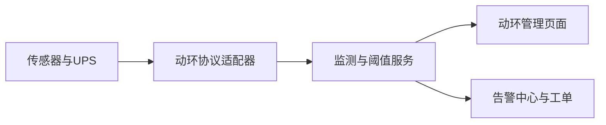
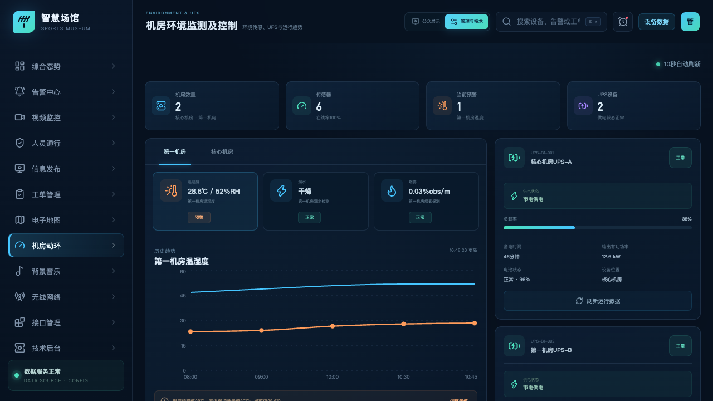
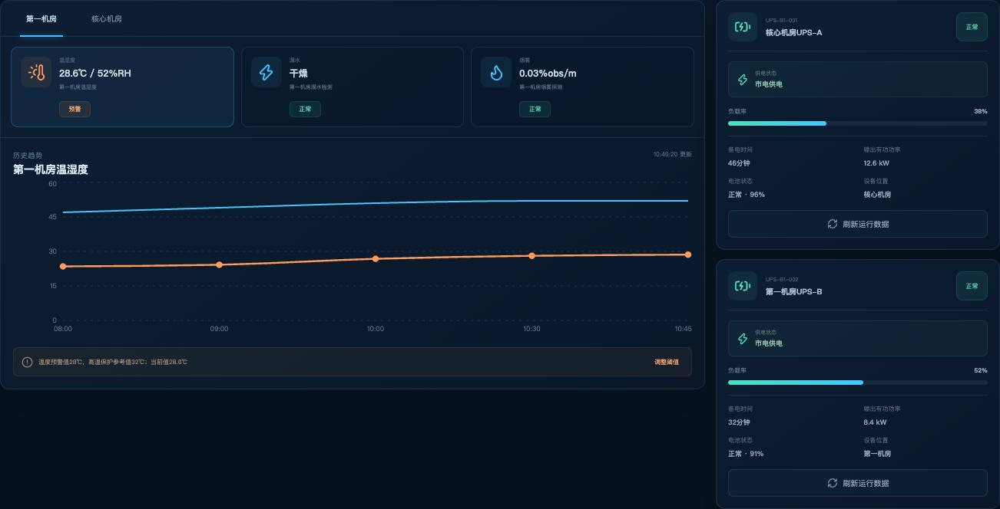
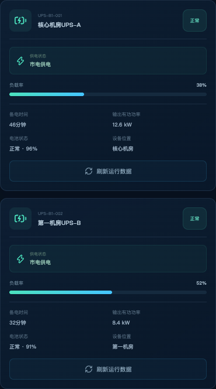
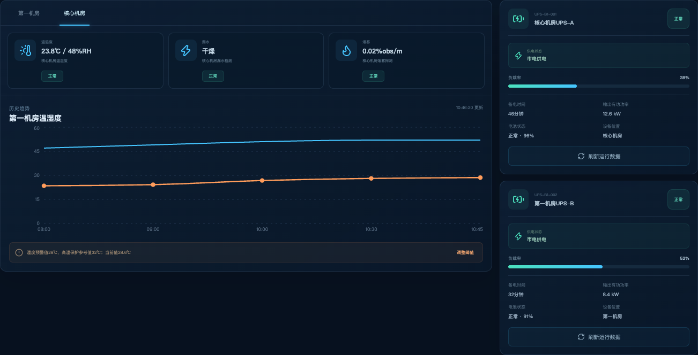
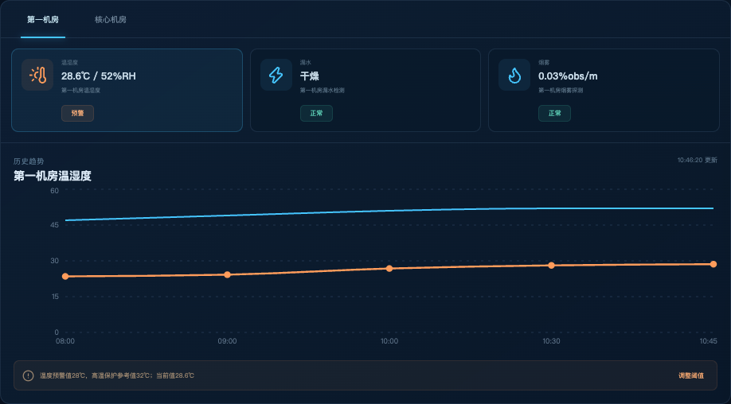

# 体育博物馆智慧化综合管理平台

## 机房环境监测及控制功能说明

| 文档属性 | 内容 |
| --- | --- |
| 文档版本 | V1.0 |
| 编制日期 | 2026-08-31 |
| 页面路由 | `/environment` |
| 适用对象 | 机房值班、设施运维、弱电和系统管理人员 |
| 系统状态 | 验收版本；动环传感器、监控状态、阈值告警和 UPS 运行统一管理 |

## 1. 建设目标

本模块统一展示机房温度、湿度、漏水、烟雾和监控设备状态，提供传感数值、设备位置、趋势、阈值和告警弹窗；同时统一管理 UPS 供电状态、备电时间、负载率、输出有功功率及电池状态。

## 2. 需求符合性

| 需求项 | 平台实现 | 结论 |
| --- | --- | --- |
| 温湿度 | 显示实时数值、状态、更新时间、历史趋势和阈值 | 符合 |
| 漏水与烟雾 | 按机房显示传感器状态和数值，异常统一进入告警中心 | 符合 |
| 监控状态、设备信息和位置 | 机房设备以统一资产 ID 和机房位置关联，监控状态可联动查看 | 符合 |
| 报警弹窗 | 数值超过阈值时生成预警并通过页面通知和告警中心提醒 | 符合 |
| UPS 运行信息 | 展示名称、供电、备电时间、负载率、有功功率、电池和位置 | 符合 |

## 3. 系统架构

* 图 1　机房动环与 UPS 架构

## 4. 功能说明

* 图 2　传感器、历史趋势与 UPS 运行信息

### 4.1 环境监测

页面按机房切换传感器。传感器卡片展示类型、名称、当前数值、运行状态和更新时间；选中后可查看历史趋势与阈值说明。烟雾和漏水使用状态值，温湿度使用连续数值。

* 图 3　机房切换、环境传感器、历史趋势与 UPS 工作区

工作区以机房为上下文，左侧集中展示环境传感器和趋势，右侧展示 UPS 运行卡片。顶部状态概览显示机房数量、传感器在线率、当前预警和 UPS 数量，使值班人员先判断整体状态，再进入具体设备。

* 图 4　温湿度、漏水、烟雾状态及历史趋势

传感器面板采用状态卡片与趋势图联动的方式。点击温湿度、漏水或烟雾卡片后，下方区域切换到对应设备的历史记录、更新时间和阈值说明；卡片同时显示设备位置和正常/预警状态，便于快速定位。

### 4.2 告警流程

* 图 5　环境异常处置流程

### 4.3 UPS 管理

UPS 卡片集中展示设备编号、名称、运行状态、市电/电池供电、预计备电时间、负载率、输出有功功率、电池容量和安装位置。刷新操作通过统一 UPS 适配器重新获取运行数据。

* 图 6　UPS 设备编号、供电、负载、功率、电池和位置

UPS 采用一机一卡的管理样式。关键供电指标不隐藏在详情弹窗中，值班人员可直接比较两台设备的负载率和备电能力；“刷新运行数据”用于主动获取设备最新状态，并保留数据更新时间和通信结果。

## 5. 监测对象与业务范围

| 对象类别 | 监测内容 | 展示方式 | 异常处理 |
| --- | --- | --- | --- |
| 温湿度 | 实时温度、湿度、更新时间 | 数值、状态卡片和趋势图 | 越限提醒、告警与恢复记录 |
| 漏水 | 漏水绳/点式传感器状态 | 正常、预警、故障 | 告警弹窗、位置联动和工单 |
| 烟雾 | 烟感状态、心跳与告警位 | 状态卡片与事件记录 | 告警提醒、视频核查与应急处理 |
| 机房监控 | 摄像头在线状态和关联通道 | 设备信息、位置和视频入口 | 设备离线提醒和运维工单 |
| UPS | 供电、负载、功率、电池和备电时间 | 运行卡片、仪表与状态 | 供电切换、负载/电池预警和工单 |

## 6. 业务角色与权限

| 角色 | 主要职责 | 主要权限 |
| --- | --- | --- |
| 机房值班人员 | 监视数值、确认异常、记录巡查结果 | 查看实时与历史数据、确认告警 |
| 设施运维人员 | 处理环境、空调、漏水和 UPS 事件 | 查看设备档案、调整授权阈值、提交工单结果 |
| 安保与消防值班 | 处理烟雾和安全相关事件 | 查看告警位置、关联视频和处置动态 |
| 系统管理员 | 维护机房、传感器、协议和阈值模板 | 设备增删改、适配器、字段映射和审计日志 |

阈值调整、设备控制和告警关闭应分别授权。具备查看权限的用户不自动获得设备控制权；阈值变更应保留变更前后数值、操作人和原因。

## 7. 机房、设备与传感器档案

### 7.1 机房档案

机房档案建议包含机房编号、名称、所在楼层、具体位置、责任部门、值班联系人、运行级别、关联摄像头和平面图节点。所有传感器和 UPS 通过机房编号归属，页面切换机房时能同步加载对应设备和历史数据。

### 7.2 传感器档案

传感器档案包含设备 ID、名称、类型、厂商型号、安装位置、通信地址、采样周期、单位、保留精度、状态、最后更新时间和适用阈值模板。位置字段可精确到机柜区、墙面、地板下方或入口，便于告警时快速定位。

### 7.3 设备在线与数据质量

平台区分“测量值正常”与“通信正常”。若传感数值在阈值内但长时间未更新，设备状态为通信异常，不将旧数值当作实时数据。采集服务对空值、越量程、时间倒退和突变数值做质量标记，供页面和告警规则使用。

## 8. 实时监测与历史趋势

### 8.1 实时页面

实时页面以机房为切换单元，传感器卡片显示当前数值、单位、状态和更新时间。选中传感器后，趋势图使用同一设备 ID 查询历史数据，避免名称重复造成数据混淆。页面自动刷新周期可配置，手动刷新不改变原始采样周期。

* 图 7　切换至核心机房后的设备、数值和位置联动

切换“核心机房”后，温湿度、漏水和烟雾卡片同步替换为该机房设备，状态值与安装位置保持一致。该交互用于验证机房上下文不会只改变标题，而会联动设备 ID、监测值、趋势查询条件和关联资产。

### 8.2 趋势查询

历史趋势可按设备、指标和时间范围查询。趋势图同时显示数值曲线和对应的预警阈值，便于判断是短时波动、持续升高还是传感器故障。导出时保留设备 ID、位置、采样时间、原始值和质量标记。

### 8.3 漏水与烟雾

漏水和烟雾以状态事件为主，同时保留定期心跳。异常状态首次出现时生成告警，持续期间更新同一事件的持续时间，不在每次采集时重复生成新告警。状态恢复后写入恢复时间，由值班人员核验是否关闭。

## 9. 阈值、告警弹窗与闭环处置

### 9.1 阈值规则

阈值规则包含指标、预警值、恢复值、持续时长、适用机房/设备、生效时段和通知策略。预警值与恢复值分开设置，可避免数值在边界附近波动时频繁生成和恢复事件。临时调整阈值可设置到期时间，到期后恢复正常模板。

### 9.2 告警弹窗

异常发生时，页面提醒展示事件编号、机房、设备、当前值/状态、阈值、发生时间和建议操作。用户可确认提醒、打开设备详情、查看关联视频或进入告警中心。关闭弹窗仅代表已阅，不代表告警已恢复或已关闭。

* 图 8　温度越限状态、当前值与阈值说明

预警状态使用醒目标识但保留一般性提示层级。选中预警传感器后，界面同时呈现当前值、预警值、高温保护参考值和趋势，帮助值班人员判断是短时波动还是持续升高，并可进入阈值配置或告警处置流程。

### 9.3 处置闭环

* 图 9　机房异常处置闭环

## 10. UPS 运行管理

### 10.1 核心运行字段

| 字段 | 说明 | 常见状态/单位 |
| --- | --- | --- |
| 设备名称与 ID | 识别 UPS 资产与数据来源 | 资产编号、显示名称 |
| 供电状态 | 当前由市电、电池或旁路供电 | 市电供电、电池供电、旁路 |
| 备电时间 | 按当前负载和电池状态计算的预计时间 | 分钟 |
| 负载率 | 当前输出负载占额定容量比例 | % |
| 输出有功功率 | 当前实际输出功率 | kW |
| 电池状态 | 电量、充放电、健康或故障状态 | %、正常、充电、放电、故障 |

### 10.2 供电切换

市电切换到电池时，平台记录切换时间、原供电状态、新状态、当前负载、电池容量和预计备电时间。市电恢复后写入恢复事件，并继续观察电池充电和健康状态，不仅依据供电恢复就判定设备完全正常。

### 10.3 负载和电池预警

负载率、备电时间和电池容量可分别设置预警规则。例如，负载持续超过管理值、备电时间低于维持关键设备所需时间、电池自检失败或电池健康状态异常时，分别生成事件，便于区分容量不足、市电异常和电池故障。

## 11. 机房监控联动

机房档案可关联一至多路摄像头。用户在动环页面查看异常时，可根据权限进入相关摄像头的实况或对应时间的录像回放。平台在关联时使用摄像头 ID 和机房 ID，不使用文字名称模糊匹配，避免跳转错误。

监控设备本身的在线状态也是动环页面的管理信息。当环境异常同时摄像头离线时，系统分别记录两个事件，并在告警详情中告知当前视频核查条件。

## 12. 后台配置与接口

- 可配置机房、设备位置、传感器类型、单位、采样周期、预警阈值和恢复阈值。
- 可配置动环 SDK 及 UPS 协议实例、设备地址、字段映射、超时与重试策略。
- 可将机房摄像头关联到机房或设备，根据权限跳转视频监控。
- 对外接口提供实时值、历史趋势、设备状态和告警事件的受权查询。

## 13. 验收要点

1. 机房切换后，传感器列表、数值、位置和趋势保持一致。
2. 温湿度、漏水、烟雾和监控状态均可查看，越限时可发出提醒。
3. UPS 六项关键运行字段齐全，数值刷新反馈正常。
4. 异常事件可进入告警中心并关联工单处理。
5. 页面和浏览器控制台无错误。

### 13.1 建议验收场景

| 场景 | 验收操作 | 预期结果 |
| --- | --- | --- |
| 机房切换 | 在第一机房和核心机房之间切换 | 传感器、位置、趋势和 UPS 数据对应正确 |
| 温度越限 | 查看超过预警值的温度传感器 | 卡片预警、阈值提示和告警事件一致 |
| 漏水/烟雾 | 查看状态事件和关联位置 | 异常可提醒、确认并转工单 |
| UPS 供电 | 查看两台 UPS 运行卡片并刷新 | 供电、备电、负载、功率、电池和位置齐全 |
| 视频联动 | 从机房或告警查看关联摄像头 | 按摄像头 ID 进入对应实况/回放入口 |
